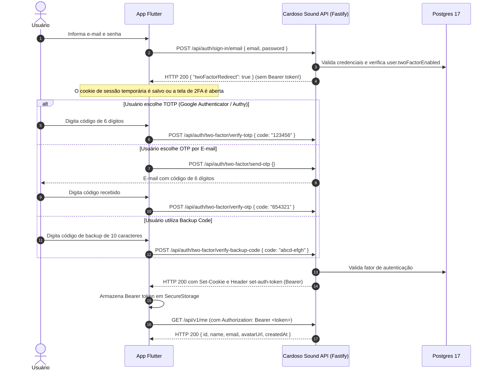

# F5-S05 — Two Factor Authentication: TOTP, OTP e Backup Codes

**Data:** 2026-09-10  
**Branch:** `feature/f5s05-two-factor`  
**GAPs endereçados:** GAP-02 e GAP-09 (metade 2FA)  
**Decisões e Specs:** D-13, D-31, D-39, D-40, D-53; `docs/specs/08-blindagem-de-seguranca.md` (§3, §8, §10); `docs/sprints/fase-5-producao/F5-S05-two-factor.md`

---

## 1. Migração 0003 — Schema Two-Factor (GAP-02 e GAP-09)

### SQL Exato (`drizzle/0003_demonic_kinsey_walden.sql`)

```sql
CREATE TABLE "two_factor" (
	"id" text PRIMARY KEY NOT NULL,
	"secret" text NOT NULL,
	"backup_codes" text NOT NULL,
	"user_id" text NOT NULL,
	"failed_attempts" integer DEFAULT 0 NOT NULL,
	"last_attempt" timestamp,
	"created_at" timestamp DEFAULT now() NOT NULL,
	"updated_at" timestamp DEFAULT now() NOT NULL
);
--> statement-breakpoint
ALTER TABLE "user" ADD COLUMN "two_factor_enabled" boolean DEFAULT false NOT NULL;--> statement-breakpoint
ALTER TABLE "two_factor" ADD CONSTRAINT "two_factor_user_id_user_id_fk" FOREIGN KEY ("user_id") REFERENCES "public"."user"("id") ON DELETE cascade ON UPDATE no action;
```

### Justificativas Arquiteturais

1. **`user.twoFactorEnabled` (`two_factor_enabled`):** Adicionada como flag booleana `NOT NULL` com valor padrão `false`. Indica rapidamente se o usuário possui autenticação de dois fatores ativada sem exigir um `JOIN` ou subquery na tabela `two_factor` durante a validação primária de credenciais em `sign-in`.
2. **Tabela `two_factor` com 8 colunas canônicas do Better Auth:**
   - `id`: Text PK gerada pelo Better Auth.
   - `secret`: Chave simétrica usada para geração e validação de TOTP (RFC 6238).
   - `backup_codes`: String serializada contendo os códigos de backup em formato hash ou cifrado.
   - `user_id`: FK apontando para `user(id)` com `ON DELETE CASCADE` estrito (quando a conta do usuário é excluída via `DELETE /api/v1/me` / R15, as credenciais de 2FA são expurgadas na mesma transação).
   - `failed_attempts` e `last_attempt`: Suporte a bloqueio e mitigação de brute force (Account Lockout) direto no registro de 2FA.
   - `created_at` e `updated_at`: Rastreabilidade de ciclo de vida.
3. **Migração Versionada:** Gerada via `pnpm db:generate` e aplicada via `pnpm db:migrate`. O comando destrutivo `pnpm db:push` **nunca** foi executado.

---

## 2. Configuração do Better Auth (`auth.config.ts`)

### Ordem de Plugins e Resolução do Desafio 2FA (Achado Crítico)

A ordem dos plugins em `betterAuth({ plugins: [...] })` provou-se crítica:

- **Problema encontrado:** Se `bearer()` for registrado **antes** de `twoFactor()`, o hook `after` do plugin bearer intercepta a resposta de autenticação intermediária do Better Auth antes que o plugin `twoFactor` remova a sessão temporária. Como consequência, o endpoint `/api/auth/sign-in/email` emitia o header `set-auth-token` mesmo para usuários com 2FA ativo, permitindo acesso indevido sem fornecer o segundo fator.
- **Solução implementada:** `twoFactor({ ... })` foi registrado **obrigatoriamente antes** de `bearer()`. Assim, `twoFactor` intercepta o fluxo primeiro, remove a sessão e o cookie, e retorna `{ twoFactorRedirect: true }`. O plugin `bearer` não detecta sessão na resposta e não emite `set-auth-token`.

### Opções do Plugin `twoFactor`

```ts
twoFactor({
  issuer: 'Cardoso Sound',
  totpOptions: {
    issuer: 'Cardoso Sound',
    digits: 6,
    period: 30,
    backupCodes: {
      amount: 10,
    },
  },
  otpOptions: {
    sendOTP: async ({ user, otp }) => {
      const { subject, html, text } = twoFactorOtpEmail({
        name: user.name,
        otp,
      });
      await mailer.sendMail({
        to: user.email,
        subject,
        html,
        text,
      });
    },
  },
  accountLockout: {
    enabled: true,
    maxFailedAttempts: 5,
    durationSeconds: 900,
  },
});
```

- **TOTP:** 6 dígitos, período de renovação de 30 segundos, emissor `Cardoso Sound`.
- **Backup Codes:** Geração inicial e regeneração de 10 códigos descartáveis.
- **OTP por E-mail:** Template dedicado `twoFactorOtpEmail` com código em destaque e texto puro, sem hyperlink (D-53, D-40).
- **Account Lockout:** Bloqueio temporário de 15 minutos (900s) após 5 tentativas incorretas consecutivas.

### Rate Limiting de Autenticação (`AUTH_RATE_LIMIT_RULES`)

O dicionário `AUTH_RATE_LIMIT_RULES` foi expandido de 8 para 12 regras, cobrindo com precisão os 4 novos endpoints de 2FA:

- `'/two-factor/send-otp'`: `{ window: 60, max: 3 }` (3 solicitações de OTP por minuto para evitar spam e sobrecarga de e-mail).
- `'/two-factor/verify-backup-code'`: `{ window: 60, max: 5 }` (5 tentativas por minuto para mitigar força bruta em códigos de backup).
- `'/two-factor/verify-otp'`: `{ window: 60, max: 5 }` (5 tentativas por minuto contra força bruta no código numérico de e-mail).
- `'/two-factor/verify-totp'`: `{ window: 60, max: 5 }` (5 tentativas por minuto contra força bruta no código de 6 dígitos TOTP).

---

## 3. Template de E-mail de OTP de 2FA (`twoFactorOtpEmail`)

Localizado em [`src/shared/email/templates.ts`](file:///home/cardosofiles/www/typescript/back-end/development/fastify/cardoso-sound-api/src/shared/email/templates.ts):

- **Código em texto puro:** O código numérico OTP é renderizado em fonte monoespaçada legível com destaque visual (`letter-spacing: 4px; font-size: 28px`).
- **Segurança contra phishing e scanners:** O template **NÃO** contém hiperlinks navegáveis (`<a>`). Scanners automáticos de segurança e gateways de e-mail que clicam em links não invalidam nem interceptam o código OTP (D-53).
- **Sanitização estrita:** O nome do usuário é sanitizado via `escapeHtml()` prevenindo qualquer injeção de HTML ou XSS em clientes de e-mail ricos.
- **Versão em texto puro:** Campo `text` gerado em conformidade para leitores de acessibilidade e clientes de terminal.

---

## 4. Particularidades Técnicas e Descobertas (`better-auth@1.7.2`)

1. **Segredo Raw vs. URI Base32 RFC 4648:**
   O Better Auth armazena o segredo cru de 32 caracteres na coluna `twoFactor.secret` no banco de dados e calcula o HMAC SHA-1 diretamente sobre os bytes dessa string. Ao emitir o payload de configuração de TOTP (`/two-factor/enable`), ele fornece `totpURI`, no qual o segredo é codificado em Base32 conforme a RFC 6238 / RFC 4648.
2. **CSRF e Header `origin`:**
   Como todas as mutações via cookie no Better Auth validam a origem da requisição, testes que utilizam `app.inject({ cookie })` para chamar rotas de 2FA devem fornecer obrigatoriamente o header `origin: env.BETTER_AUTH_URL` (`http://localhost:3333`).
3. **Parser de JSON do Fastify e Requisições Vazias:**
   O endpoint `POST /api/auth/two-factor/send-otp` pode ser chamado sem parâmetros adicionais se a sessão do desafio já estiver no cookie. Se o cliente enviar `content-type: application/json`, o Fastify exige um JSON válido no corpo; portanto `payload: {}` é necessário para evitar o erro `FST_ERR_CTP_EMPTY_JSON_BODY` (HTTP 400).
4. **Renovação de Sessão na Ativação de 2FA:**
   Ao verificar com sucesso o código TOTP inicial (`POST /api/auth/two-factor/verify-totp`), o Better Auth invalida a sessão temporária usada durante a configuração e emite uma nova sessão promovida. Clientes e suítes de teste devem atualizar seu token/cookie de sessão capturando o novo `set-auth-token` ou `set-cookie`.

---

## 5. Guia para o Aplicativo Flutter (Contrato de Integração)

### Fluxo de Login com 2FA Ativado



### Regras Vitais para o Cliente Flutter

1. **Detecção de Desafio:** Quando o payload retornado por `POST /api/auth/sign-in/email` possuir `twoFactorRedirect: true`, o cliente **não deve** tentar navegar para a Home nem buscar perfil via `/api/v1/me`, pois a autenticação está incompleta.
2. **Headers no Mobile:** Ao realizar as chamadas de verificação (`/two-factor/verify-*`), o Flutter deve manter os cookies da resposta do `sign-in/email` ou repassar o cabeçalho retornado.
3. **Backup Codes:** Cada código de backup só pode ser utilizado **uma única vez**. Ao ser consumido, ele é removido do armazenamento permanente.

---

## 6. Cobertura de Testes

- **Testes Unitários:**
  - `tests/unit/shared/email/two-factor-otp.test.ts` (4 testes: T25–T28 cobrindo geração de template OTP, escaping de HTML, ausência de tags `<a>` e versionamento em texto puro).
- **Testes de Integração:**
  - `tests/integration/schema-two-factor.test.ts` (5 testes: T1–T5 cobrindo colunas do schema Drizzle, constraints, tipo booleano de `twoFactorEnabled` e integridade referencial `ON DELETE CASCADE`).
  - `tests/integration/auth-two-factor.test.ts` (19 testes: T6–T24 cobrindo ciclo de vida completo: enable, verify-totp, challenge no sign-in, bloqueio de bearer sem 2FA, verificação por backup code, invalidação de backup code consumido, regeneração de backup codes, envio e verificação de OTP por e-mail, rejeição de OTP inválido, desabilitação com senha e account lockout após 5 falhas).
  - `tests/integration/auth-rate-limit.test.ts` (T27 atualizado para validar a presença exata das 12 regras de rate limit).
- **Total no Workspace:** 44 arquivos de teste, 400 testes executados, **400 testes verdes (100% de sucesso)**.
