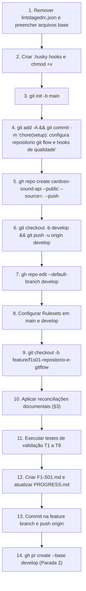

# Plano de Execução — F1-S01: Repositório e Git Flow

| Metadado                           | Detalhe                                                                         |
| ---------------------------------- | ------------------------------------------------------------------------------- |
| **Fase**                           | F1 — Fundação                                                                   |
| **Sprint**                         | `F1-S01`                                                                        |
| **Branch de Trabalho**             | `feature/f1s01-repositorio-e-gitflow` (após commit inicial em `main`)           |
| **Branch Base / Alvo do PR**       | `develop`                                                                       |
| **Dependências**                   | Nenhuma                                                                         |
| **Escreve TypeScript de Negócio?** | Não                                                                             |
| **Pré-requisito Humano (B1)**      | ✅ `gh auth status` verificado (autenticado como `Cardosofiles`, protocolo SSH) |

---

## 1. Escopo e Blast Radius Fechado

Em cumprimento estrito à [D-30](file:///.agents/memory/DECISIONS.md#L253-L260) e ao [F1-S01 §4](file:///docs/sprints/fase-1-fundacao/F1-S01-repositorio-e-gitflow.md#L60-L105), **nenhum arquivo fora da lista abaixo será tocado**:

```
Criar:
  .nvmrc
  .husky/pre-commit
  .husky/commit-msg
  .lintstagedrc.json

Preencher (atualmente 0 bytes):
  .gitignore
  .gitattributes
  .dockerignore
  .prettierrc.json
  .prettierignore
  commitlint.config.mjs

Editar (reconciliação documental — D-04c):
  README.md
  AGENTS.md
  .agents/rules/testing.md
  .agents/skills/test-runner/SKILL.md
  .agents/mcp_config.json

Remover:
  lintstagedrc.json (sem ponto — arquivo morto)

Memória:
  .agents/memory/PROGRESS.md
  .agents/memory/F1-S01.md
```

> **Não tocar em:** `src/**`, `tests/**`, `docs/specs/**`, `docs/sprints/**`, `package.json`, `tsconfig.json`, `eslint.config.mjs`.

---

## 2. Conteúdo Exato dos Arquivos de Configuração

### 2.1 `.nvmrc`

```
24
```

### 2.2 `.gitignore`

```gitignore
node_modules/
dist/
coverage/
.env
.env.*.local
*.log
.DS_Store
.idea/
.vitest-cache/

# Garante versionamento do template de variáveis
!.env.example
```

### 2.3 `.gitattributes`

```gitattributes
* text=auto eol=lf
pnpm-lock.yaml -diff linguist-generated
```

### 2.4 `.dockerignore`

```dockerignore
node_modules
dist
.git
tests
docs
.agents
coverage
*.md
.env*
```

### 2.5 `.prettierrc.json`

```json
{
  "semi": true,
  "singleQuote": true,
  "trailingComma": "all",
  "printWidth": 100,
  "tabWidth": 2,
  "endOfLine": "lf"
}
```

### 2.6 `.prettierignore`

```prettierignore
node_modules
dist
coverage
pnpm-lock.yaml
drizzle
```

### 2.7 `commitlint.config.mjs`

```javascript
export default {
  extends: ['@commitlint/config-conventional'],
  rules: {
    'type-enum': [
      2,
      'always',
      ['feat', 'fix', 'refactor', 'test', 'chore', 'docs', 'ci', 'perf', 'style', 'revert'],
    ],
    'scope-enum': [
      2,
      'always',
      [
        'setup',
        'config',
        'db',
        'auth',
        'tracks',
        'artists',
        'playlists',
        'favorites',
        'users',
        'health',
        'plugins',
        'tests',
        'ci',
        'deploy',
        'docs',
      ],
    ],
    'scope-empty': [2, 'never'],
    'subject-case': [2, 'always', 'lower-case'],
    'header-max-length': [2, 'always', 100],
  },
};
```

### 2.8 `.lintstagedrc.json` (substituindo `lintstagedrc.json`)

```json
{
  "*.{ts,mts}": ["eslint --fix", "prettier --write"],
  "*.{json,md,yml,yaml}": ["prettier --write"]
}
```

### 2.9 `.husky/pre-commit` e `.husky/commit-msg` (Husky 9)

- `.husky/pre-commit`:
  ```bash
  pnpm lint-staged
  ```
- `.husky/commit-msg`:
  ```bash
  pnpm commitlint --edit "$1"
  ```
- Ambos com permissão executável (`chmod +x`). Sem shebang ou referências obsoletas a `husky.sh`.

---

## 3. Reconciliação Documental Cirúrgica (D-04c)

Serão realizadas as 15 alterações pontuais exigidas, sem reescrever a estrutura dos documentos:

| #   | Arquivo                                                                              | Onde / O que está                                               | O que será colocado                                                               | Decisão Base |
| --- | ------------------------------------------------------------------------------------ | --------------------------------------------------------------- | --------------------------------------------------------------------------------- | ------------ |
| 1   | [`AGENTS.md`](file:///AGENTS.md)                                                     | Node.js (v20+)                                                  | `Node.js 24 LTS`                                                                  | D-01         |
| 2   | [`AGENTS.md`](file:///AGENTS.md)                                                     | PostgreSQL 16                                                   | `PostgreSQL 17`                                                                   | D-01         |
| 3   | [`AGENTS.md`](file:///AGENTS.md)                                                     | Zod v3                                                          | `Zod 4`                                                                           | D-01         |
| 4   | [`AGENTS.md`](file:///AGENTS.md)                                                     | Playwright (E2E HTTP flows / MCP)                               | Vitest com `app.inject()` (remover referências ao Playwright)                     | D-03         |
| 5   | [`AGENTS.md`](file:///AGENTS.md)                                                     | "alteração de permissões RBAC"                                  | Remover (MVP não possui RBAC)                                                     | D-09         |
| 6   | [`README.md`](file:///README.md)                                                     | Node.js 22+                                                     | `Node.js 24+`                                                                     | D-01         |
| 7   | [`README.md`](file:///README.md)                                                     | Testes E2E: Playwright                                          | `Vitest + app.inject()`                                                           | D-03         |
| 8   | [`README.md`](file:///README.md)                                                     | Tabela de rotas sem `/v1` (`/api/tracks`, `/api/artists`, etc.) | Rotas de domínio atualizadas para `/api/v1/...` (auth mantida em `/api/auth/...`) | D-16         |
| 9   | [`README.md`](file:///README.md)                                                     | Menções a "rotas de streaming", "contadores", "streams"         | Remover menções (MVP retorna `audioUrl` direto, sem contadores)                   | D-10         |
| 10  | [`README.md`](file:///README.md)                                                     | `@neondatabase/serverless` na tabela e nota de avaliação        | Remover da tabela e notas                                                         | D-04         |
| 11  | [`README.md`](file:///README.md)                                                     | Dockerfile "(Node.js 20 Alpine)"                                | `(node:24-alpine)`                                                                | D-01         |
| 12  | [`README.md`](file:///README.md)                                                     | docker-compose "PostgreSQL 16"                                  | `PostgreSQL 17`                                                                   | D-01         |
| 13  | [`.agents/rules/testing.md`](file:///.agents/rules/testing.md)                       | Seção 1.3 Playwright                                            | Substituir por `Vitest + app.inject()`                                            | D-03         |
| 14  | [`.agents/skills/test-runner/SKILL.md`](file:///.agents/skills/test-runner/SKILL.md) | Seção 3 com `pnpm playwright test`                              | Atualizar para execução com Vitest (`pnpm vitest run --project e2e`)              | D-03         |
| 15  | [`.agents/mcp_config.json`](file:///.agents/mcp_config.json)                         | Entrada `"playwright"` no JSON                                  | Remover bloco `"playwright"` mantendo placeholders de tokens                      | D-03, D-05   |

Além disso, adicionaremos no topo do [`README.md`](file:///README.md) um bloco apontando para `docs/specs/` e `docs/sprints/README.md` como fonte de verdade do escopo.

---

## 4. Passo a Passo Operacional (Git Flow e GitHub)



### 4.1 Sequência de Comandos Git e GitHub

1. **Arquivos Base & Husky:**
   - Remover `lintstagedrc.json`
   - Criar `.lintstagedrc.json`, `.nvmrc`
   - Preencher `.gitignore`, `.gitattributes`, `.dockerignore`, `.prettierrc.json`, `.prettierignore`, `commitlint.config.mjs`
   - Rodar `pnpm prepare`
   - Gerar `.husky/pre-commit` e `.husky/commit-msg` com `chmod +x`

2. **Commit Inicial em `main` e Criação do Repositório:**

   ```bash
   git init -b main
   git add -A
   git commit -m "chore(setup): configura repositorio git flow e hooks de qualidade"
   gh repo create cardoso-sound-api --public --source=. --push \
     --description "API RESTful de catálogo musical para app Flutter — Fastify 5, TypeScript, PostgreSQL, Drizzle"
   git checkout -b develop && git push -u origin develop
   gh repo edit --default-branch develop
   ```

3. **Rulesets do GitHub (spec `06` §1):**
   - Configurar rulesets para `main` e `develop` via `gh api`:
     - Push direto bloqueado
     - PR obrigatório
     - Linear history habilitado
     - _Check `ci` ausente temporariamente_ (será exigido a partir de F1-S04)

4. **Branch de Trabalho e Reconciliação:**
   ```bash
   git checkout -b feature/f1s01-repositorio-e-gitflow
   ```
   - Aplicar alterações em `README.md`, `AGENTS.md`, `.agents/rules/testing.md`, `.agents/skills/test-runner/SKILL.md`, `.agents/mcp_config.json`.
   - Criar `.agents/memory/F1-S01.md` a partir de `_TEMPLATE.md`.
   - Atualizar `.agents/memory/PROGRESS.md` (remover B1 e B3, adicionar pendência de ruleset CI).

---

## 5. Matriz de Testes Obrigatórios (T1–T8)

| #      | Verificação                                    | Comando de Prova                                  | Resultado Esperado                                     |
| ------ | ---------------------------------------------- | ------------------------------------------------- | ------------------------------------------------------ |
| **T1** | commitlint rejeita mensagem inválida           | `echo "mensagem ruim" \| pnpm commitlint`         | Código de saída ≠ 0                                    |
| **T2** | commitlint aceita mensagem válida              | `echo "feat(setup): x" \| pnpm commitlint`        | Código de saída = 0                                    |
| **T3** | commitlint rejeita escopo fora da lista        | `echo "feat(banana): x" \| pnpm commitlint`       | Código de saída ≠ 0                                    |
| **T4** | `.env` está ignorado                           | `git check-ignore -v .env`                        | Regra casa com `.gitignore`                            |
| **T5** | `.env.example` **não** está ignorado           | `git check-ignore .env.example`                   | Código de saída ≠ 0 (não ignorado)                     |
| **T6** | pre-commit dispara formatação                  | Hook roda `lint-staged`                           | Sucesso na validação                                   |
| **T7** | Repositório público e default branch `develop` | `gh repo view --json visibility,defaultBranchRef` | `visibility: PUBLIC`, `defaultBranchRef.name: develop` |
| **T8** | Nenhum segredo no histórico                    | `git log --all -p \| grep -iE '(ghp_              | sk-                                                    | password=)'` | Saída vazia |

---

## 6. Definition of Done e Encerramento da Sessão

- [ ] Repositório público `Cardosofiles/cardoso-sound-api` criado no GitHub
- [ ] Branches remotas `main` e `develop` existentes
- [ ] Branch padrão configurada para `develop`
- [ ] Hooks `.husky/pre-commit` e `.husky/commit-msg` funcionais e testados
- [ ] `.lintstagedrc.json` ativo e `lintstagedrc.json` excluído
- [ ] As 15 reconciliações documentais aplicadas fielmente
- [ ] Casos de teste T1–T8 executados com sucesso
- [ ] PR criado de `feature/f1s01-repositorio-e-gitflow` para `develop` com o corpo da spec `06` §4
- [ ] Memória atualizada (`PROGRESS.md` atualizado e `F1-S01.md` preenchido)
- [ ] **Parada 2 (Protocolo §8):** Reportar link do PR e parar imediatamente sem executar merge.
