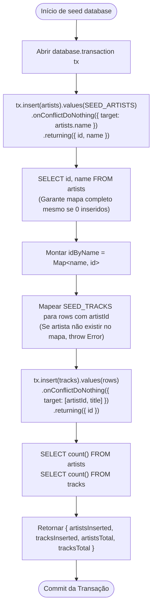

# Plano de Implementação — Sprint F2-S02: Seed do Catálogo e Harness de Integração

> **Status:** 🟡 Em Planejamento (Aguardando Autorização Explícita — Etapa 3 do Protocolo)  
> **Fase:** F2 — Catálogo  
> **Branch Alvo:** `feature/f2s02-seed-e-harness-de-integracao` (a partir de `develop`)  
> **Depende de:** F2-S01 (Schema Drizzle completo e migração inicial com `pg_trgm`)  
> **Specs de Referência:**
>
> - [`docs/specs/02-modelo-de-dados.md`](file:///run/media/joaocardoso/discoF/Cardosofiles/typescript/back-end/fastify/cardoso-sound-api/docs/specs/02-modelo-de-dados.md) (§9 — Seed)
> - [`docs/specs/05-testes-e-qualidade.md`](file:///run/media/joaocardoso/discoF/Cardosofiles/typescript/back-end/fastify/cardoso-sound-api/docs/specs/05-testes-e-qualidade.md) (§3 — Testes de Integração e Harness)
> - [`docs/specs/00-visao-geral.md`](file:///run/media/joaocardoso/discoF/Cardosofiles/typescript/back-end/fastify/cardoso-sound-api/docs/specs/00-visao-geral.md) (§6 — Volume do Catálogo)
> - [`docs/specs/07-protocolo-dos-agentes.md`](file:///run/media/joaocardoso/discoF/Cardosofiles/typescript/back-end/fastify/cardoso-sound-api/docs/specs/07-protocolo-dos-agentes.md)
> - [`docs/sprints/fase-2-catalogo/F2-S02-seed-e-harness-de-integracao.md`](file:///run/media/joaocardoso/discoF/Cardosofiles/typescript/back-end/fastify/cardoso-sound-api/docs/sprints/fase-2-catalogo/F2-S02-seed-e-harness-de-integracao.md)
> - [`.agents/memory/DECISIONS.md`](file:///run/media/joaocardoso/discoF/Cardosofiles/typescript/back-end/fastify/cardoso-sound-api/.agents/memory/DECISIONS.md) (especialmente **D-28**, **D-36**, **D-39**, **D-40**)

---

## 1. Contexto e Objetivos

A sprint **F2-S02** possui duas entregas simbióticas e fundamentais que se provam mutuamente:

1. **O Harness de Integração Reutilizável ([`tests/setup/testcontainers.ts`](file:///run/media/joaocardoso/discoF/Cardosofiles/typescript/back-end/fastify/cardoso-sound-api/tests/setup/testcontainers.ts)):**
   - Fornece a infraestrutura de testes de integração e E2E para todo o restante do projeto.
   - Sobe um container efêmero `postgres:17-alpine`, aplica automaticamente as migrações SQL de `drizzle/` via migrator do Drizzle e devolve a instância tipada de `Database` (`db`), o `pg.Pool`, a `connectionString` e a rotina segura e idempotente de `stop()`.
   - Fornece a função `truncateAll(db)`, que executa `TRUNCATE "user", session, account, verification, artists, tracks, playlists, playlist_tracks, favorites RESTART IDENTITY CASCADE` para isolar casos de teste sem depender de rollback transacional (o qual esconderia falhas de integridade diferidas).
   - Migra o teste existente [`tests/integration/health.test.ts`](file:///run/media/joaocardoso/discoF/Cardosofiles/typescript/back-end/fastify/cardoso-sound-api/tests/integration/health.test.ts) (que continha container inline) para consumir este novo harness centralizado.

2. **O Seed Idempotente do Catálogo Musical ([`src/db/seed/seed.ts`](file:///run/media/joaocardoso/discoF/Cardosofiles/typescript/back-end/fastify/cardoso-sound-api/src/db/seed/seed.ts)):**
   - Popula a base de dados com **8 artistas fictícios** e **40 faixas de áudio**, cobrindo com precisão os 6 gêneros suportados (`rock`, `pop`, `electronic`, `hip-hop`, `jazz`, `lo-fi`), com cada gênero tendo no mínimo 5 faixas (**D-28**).
   - Utiliza dados estáticos em [`src/db/seed/data/artists.data.ts`](file:///run/media/joaocardoso/discoF/Cardosofiles/typescript/back-end/fastify/cardoso-sound-api/src/db/seed/data/artists.data.ts) e [`src/db/seed/data/tracks.data.ts`](file:///run/media/joaocardoso/discoF/Cardosofiles/typescript/back-end/fastify/cardoso-sound-api/src/db/seed/data/tracks.data.ts).
   - Executa inteiramente dentro de uma transação (`database.transaction()`).
   - Garante **idempotência estrita**: uma 2ª execução insere 0 artistas e 0 faixas sem lançar erros, implementando a releitura mandatória de IDs via `SELECT id, name FROM artists` para associar corretamente as faixas mesmo quando o `insert` de artistas não retornar linhas devido ao `onConflictDoNothing`.
   - Pode ser consumido programaticamente como função em testes (`seed(ctx.db)`) ou diretamente via CLI (`tsx src/db/seed/seed.ts`).

---

## 2. Blast Radius e Controle Estrito de Arquivos

Em rigorosa observância à seção 4 da sprint [`F2-S02-seed-e-harness-de-integracao.md`](file:///run/media/joaocardoso/discoF/Cardosofiles/typescript/back-end/fastify/cardoso-sound-api/docs/sprints/fase-2-catalogo/F2-S02-seed-e-harness-de-integracao.md):

### Arquivos a Criar:

- [`tests/integration/schema.test.ts`](file:///run/media/joaocardoso/discoF/Cardosofiles/typescript/back-end/fastify/cardoso-sound-api/tests/integration/schema.test.ts) (casos nominais T1 a T10 — validação real de constraints, cascades, PKs compostas e relações Drizzle)
- [`tests/integration/seed.test.ts`](file:///run/media/joaocardoso/discoF/Cardosofiles/typescript/back-end/fastify/cardoso-sound-api/tests/integration/seed.test.ts) (casos nominais T11 a T18 — validação de idempotência, integridade do catálogo e volume de dados)
- [`docs/agents-plans/plan-f2-s02-seed-e-harness-de-integracao.md`](file:///run/media/joaocardoso/discoF/Cardosofiles/typescript/back-end/fastify/cardoso-sound-api/docs/agents-plans/plan-f2-s02-seed-e-harness-de-integracao.md) (persistência do plano no repositório — Regra 6)

### Arquivos a Preencher (atualmente com 0 bytes):

- [`tests/setup/testcontainers.ts`](file:///run/media/joaocardoso/discoF/Cardosofiles/typescript/back-end/fastify/cardoso-sound-api/tests/setup/testcontainers.ts)
- [`src/db/seed/data/artists.data.ts`](file:///run/media/joaocardoso/discoF/Cardosofiles/typescript/back-end/fastify/cardoso-sound-api/src/db/seed/data/artists.data.ts)
- [`src/db/seed/data/tracks.data.ts`](file:///run/media/joaocardoso/discoF/Cardosofiles/typescript/back-end/fastify/cardoso-sound-api/src/db/seed/data/tracks.data.ts)
- [`src/db/seed/seed.ts`](file:///run/media/joaocardoso/discoF/Cardosofiles/typescript/back-end/fastify/cardoso-sound-api/src/db/seed/seed.ts)

### Arquivos a Editar:

- [`tests/integration/health.test.ts`](file:///run/media/joaocardoso/discoF/Cardosofiles/typescript/back-end/fastify/cardoso-sound-api/tests/integration/health.test.ts) (migração para usar `startTestDatabase()`)
- [`.agents/memory/PROGRESS.md`](file:///run/media/joaocardoso/discoF/Cardosofiles/typescript/back-end/fastify/cardoso-sound-api/.agents/memory/PROGRESS.md) (marcação de F2-S02 como concluído e apontamento para F2-S03)
- [`.agents/memory/F2-S02.md`](file:///run/media/joaocardoso/discoF/Cardosofiles/typescript/back-end/fastify/cardoso-sound-api/.agents/memory/F2-S02.md) (memória técnica da sprint contendo assinatura do harness, catálogo e tempo de execução)

### Arquivos Estritamente Intocáveis nesta Sprint:

- `src/db/schema/**` e `drizzle/**` (estabilizados e migrados em F2-S01)
- `src/db/client.ts` (já finalizado em F1-S06)
- `src/modules/**` (escopo das sprints F2-S03 em diante)

---

## 3. Especificação Detalhada dos Componentes e Contratos

### 3.1 Harness de Testcontainers (`tests/setup/testcontainers.ts`)

#### Contrato:

```typescript
import { PostgreSqlContainer, type StartedPostgreSqlContainer } from '@testcontainers/postgresql';
import { sql } from 'drizzle-orm';
import { drizzle } from 'drizzle-orm/node-postgres';
import { migrate } from 'drizzle-orm/node-postgres/migrator';
import pg from 'pg';
import type { Database } from '../../src/db/client.js';
import * as schema from '../../src/db/schema/index.js';

export interface TestDatabase {
  db: Database;
  pool: pg.Pool;
  connectionString: string;
  stop: () => Promise<void>;
}

export async function startTestDatabase(): Promise<TestDatabase>;
export async function truncateAll(db: Database): Promise<void>;
```

#### Regras de Implementação:

1. **Imagem oficial:** `postgres:17-alpine` (garante alinhamento de major com Docker local e Railway).
2. **Migrações:** Executadas com `migrate(db, { migrationsFolder: './drizzle' })`. O caminho é relativo à raiz do workspace (`cwd` do Vitest). Não usar `import.meta.url`.
3. **Pool de Teste:** Criado com `connectionTimeoutMillis: 2000`, `max: 5` e listener de erro `pool.on('error', () => {})` para suprimir exceções espúrias quando o container for derrubado.
4. **Idempotência no encerramento (`stop`):** O método `stop` deve proteger contra múltiplas chamadas consecutivas, fechando o `pool` antes de chamar `container.stop()`, ignorando falhas com blocos `try/catch` para nunca travar a suíte do Vitest.
5. **Truncate limpo e seguro (`truncateAll`):**
   ```typescript
   export async function truncateAll(db: Database): Promise<void> {
     await db.execute(
       sql`TRUNCATE "user", session, account, verification, artists, tracks, playlists, playlist_tracks, favorites RESTART IDENTITY CASCADE;`,
     );
   }
   ```
   _Nota crítica:_ A palavra reservada `"user"` deve estar entre aspas duplas, prevenindo erro de sintaxe do PostgreSQL.

---

### 3.2 Dados de Artistas (`src/db/seed/data/artists.data.ts`)

#### Contrato:

```typescript
export interface SeedArtist {
  name: string;
  bio: string;
  avatarUrl: string;
}

export const SEED_ARTISTS: readonly SeedArtist[];
```

#### Regras de Negócio e Dados:

- Exatamente **8 artistas** fictícios (sem artistas reais).
- Cada artista com `name` único, `bio` plausível (1-2 frases) e `avatarUrl` estável (ex.: avatares do Unsplash ou DiceBear).
- **Sem UUIDs literais** — os IDs são gerados automaticamente pelo PostgreSQL via `defaultRandom()`.

#### Lista Canônica dos 8 Artistas:

1. **Aurora Avenue** — _"Alt-rock five-piece delivering punchy guitar riffs, driving rhythms, and introspective lyricism."_
2. **Lunar Echoes** — _"Post-rock and ambient collective crafting atmospheric guitar textures and cinematic soundscapes."_
3. **Velvet Horizon** — _"Indie pop outfit blending acoustic warmth with lush vocal harmonies and dreamy synthesizer melodies."_
4. **The Solar Waves** — _"Electronic synthpop duo from Berlin blending analog synth nostalgia with modern electro beats."_
5. **Neon Mirage** — _"Cyberpunk and dark synthwave producer crafting driving basslines, gritty distortion, and nocturnal moods."_
6. **Dusty Grooves** — _"Lo-fi hip-hop beatmaker combining vintage vinyl crackles with soothing jazz-infused piano loops."_
7. **Echoes of Orion** — _"Boom-bap and conscious hip-hop lyricist pairing intricate wordplay with soulful vintage samples."_
8. **Quantum Drift** — _"Instrumental jazz fusion ensemble exploring progressive polyrhythms and intricate modal improvisations."_

---

### 3.3 Dados de Faixas (`src/db/seed/data/tracks.data.ts`)

#### Contrato:

```typescript
import type { Genre } from '../../../config/constants.js';

export interface SeedTrack {
  artistName: string; // referência ao nome do artista — NUNCA UUID literal
  title: string;
  album: string;
  genre: Genre; // tipagem estrita com os 6 gêneros de constants.ts
  durationSeconds: number;
  coverUrl: string;
  audioUrl: string;
}

export const SEED_TRACKS: readonly SeedTrack[];
```

#### Regras de Negócio e Distribuição de Gêneros:

- Exatamente **40 faixas**, exatamente **5 faixas por artista**.
- Cada artista possui **2 álbuns** distintos (distribuição 3 faixas no primeiro, 2 no segundo).
- Cada `title` é estritamente único dentro do respectivo artista (respeitando a constraint `UNIQUE(artist_id, title)`).
- **Distribuição estrita dos 6 gêneros (D-28 e spec §5.2):**
  - `rock`: **8 faixas**
  - `pop`: **7 faixas**
  - `electronic`: **7 faixas**
  - `hip-hop`: **6 faixas**
  - `jazz`: **6 faixas**
  - `lo-fi`: **6 faixas**
  - _Total:_ 8 + 7 + 7 + 6 + 6 + 6 = 40 (todos os gêneros possuem $\ge 5$ faixas).
- `durationSeconds`: valores realistas entre 120 e 380 segundos.
- `audioUrl`: URLs oficiais do SoundHelix (`https://www.soundhelix.com/examples/mp3/SoundHelix-Song-N.mp3`, onde $N \in [1, 16]$). A repetição de áudios é esperada e aceita (**D-28**).
- `coverUrl`: URLs de capa de álbum funcionais e estáveis.

#### Mapeamento de Faixas por Artista e Gênero:

1. **Aurora Avenue** (5 faixas — 5 Rock):
   - Álbum: _Starlight Reverie_
     - _"Midnight Overdrive"_ | `rock` | 215 s | SoundHelix-Song-1.mp3
     - _"Shadows in the Mist"_ | `rock` | 198 s | SoundHelix-Song-2.mp3
     - _"Electric Pulse"_ | `rock` | 245 s | SoundHelix-Song-3.mp3
   - Álbum: _Glass Horizon_
     - _"Broken Reflections"_ | `rock` | 180 s | SoundHelix-Song-4.mp3
     - _"Desert Road"_ | `rock` | 260 s | SoundHelix-Song-5.mp3

2. **Lunar Echoes** (5 faixas — 3 Rock, 2 Electronic):
   - Álbum: _Celestial Resonance_
     - _"Gravity Well"_ | `rock` | 320 s | SoundHelix-Song-6.mp3
     - _"Orbit Decay"_ | `rock` | 295 s | SoundHelix-Song-7.mp3
     - _"Solar Flare"_ | `rock` | 230 s | SoundHelix-Song-8.mp3
   - Álbum: _Vacuum Chamber_
     - _"Static Silence"_ | `electronic` | 210 s | SoundHelix-Song-9.mp3
     - _"Cosmic Tide"_ | `electronic` | 275 s | SoundHelix-Song-10.mp3

3. **Velvet Horizon** (5 faixas — 5 Pop):
   - Álbum: _Pastel Skies_
     - _"Golden Hour"_ | `pop` | 195 s | SoundHelix-Song-11.mp3
     - _"Whispering Breeze"_ | `pop` | 210 s | SoundHelix-Song-12.mp3
     - _"Summer Nostalgia"_ | `pop` | 185 s | SoundHelix-Song-13.mp3
   - Álbum: _Neon Memories_
     - _"City Lights Fade"_ | `pop` | 220 s | SoundHelix-Song-14.mp3
     - _"Afterglow"_ | `pop` | 205 s | SoundHelix-Song-15.mp3

4. **The Solar Waves** (5 faixas — 3 Electronic, 2 Pop):
   - Álbum: _Digital Dawn_
     - _"Synthesized Dreams"_ | `electronic` | 240 s | SoundHelix-Song-16.mp3
     - _"Laser Grid"_ | `electronic` | 190 s | SoundHelix-Song-1.mp3
     - _"Retrofutura"_ | `electronic` | 255 s | SoundHelix-Song-2.mp3
   - Álbum: _Silicon Sunset_
     - _"Analog Hearts"_ | `pop` | 198 s | SoundHelix-Song-3.mp3
     - _"Virtual Velocity"_ | `pop` | 212 s | SoundHelix-Song-4.mp3

5. **Neon Mirage** (5 faixas — 2 Electronic, 3 Lo-Fi):
   - Álbum: _Cyber Odyssey_
     - _"Midnight Circuit"_ | `electronic` | 265 s | SoundHelix-Song-5.mp3
     - _"Chroma Shift"_ | `electronic` | 230 s | SoundHelix-Song-6.mp3
   - Álbum: _Sublevel Zero_
     - _"Underground Signal"_ | `lo-fi` | 165 s | SoundHelix-Song-7.mp3
     - _"Neon Rain"_ | `lo-fi` | 155 s | SoundHelix-Song-8.mp3
     - _"Dark Alley Resonance"_ | `lo-fi` | 180 s | SoundHelix-Song-9.mp3

6. **Dusty Grooves** (5 faixas — 3 Lo-Fi, 2 Hip-Hop):
   - Álbum: _Coffee & Vinyl_
     - _"Morning Brew"_ | `lo-fi` | 140 s | SoundHelix-Song-10.mp3
     - _"Rainy Window"_ | `lo-fi` | 150 s | SoundHelix-Song-11.mp3
     - _"Sunday Afternoon"_ | `lo-fi` | 160 s | SoundHelix-Song-12.mp3
   - Álbum: _Tape Cassette Memories_
     - _"Late Night Study"_ | `hip-hop` | 175 s | SoundHelix-Song-13.mp3
     - _"Faded Polaroids"_ | `hip-hop` | 190 s | SoundHelix-Song-14.mp3

7. **Echoes of Orion** (5 faixas — 4 Hip-Hop, 1 Jazz):
   - Álbum: _Concrete Metaphor_
     - _"Street Philosophy"_ | `hip-hop` | 205 s | SoundHelix-Song-15.mp3
     - _"Boom Bap Renaissance"_ | `hip-hop` | 215 s | SoundHelix-Song-16.mp3
     - _"Rhyme Scheme"_ | `hip-hop` | 195 s | SoundHelix-Song-1.mp3
   - Álbum: _Midnight Cipher_
     - _"Cipher in the Dark"_ | `hip-hop` | 225 s | SoundHelix-Song-2.mp3
     - _"Urban Tapestry"_ | `jazz` | 250 s | SoundHelix-Song-3.mp3

8. **Quantum Drift** (5 faixas — 5 Jazz):
   - Álbum: _Blue Note Continuum_
     - _"Synchronous Swing"_ | `jazz` | 310 s | SoundHelix-Song-4.mp3
     - _"Modal Horizons"_ | `jazz` | 345 s | SoundHelix-Song-5.mp3
     - _"Midnight in Montreux"_ | `jazz` | 290 s | SoundHelix-Song-6.mp3
   - Álbum: _Fusion Dynamics_
     - _"Chromatic Velocity"_ | `jazz` | 270 s | SoundHelix-Song-7.mp3
     - _"Velvet Saxophone"_ | `jazz` | 325 s | SoundHelix-Song-8.mp3

---

### 3.4 Script e Módulo de Seed (`src/db/seed/seed.ts`)

#### Contrato:

```typescript
export async function seed(database: Database): Promise<{
  artistsInserted: number;
  tracksInserted: number;
  artistsTotal: number;
  tracksTotal: number;
}>;
```

#### Fluxo de Execução Transacional e Idempotente:



#### Execução CLI Autônoma:

- O arquivo deve verificar se está sendo executado diretamente via CLI (`tsx src/db/seed/seed.ts`):
  ```typescript
  import { fileURLToPath } from 'node:url';

  const isDirectExecution =
    process.argv[1] &&
    (fileURLToPath(import.meta.url) === process.argv[1] || process.argv[1].endsWith('seed.ts'));

  if (isDirectExecution) {
    void (async () => {
      try {
        process.stdout.write('[Database Seed] Starting catalog seed...\n');
        const result = await seed(db);
        process.stdout.write(
          `[Database Seed] Finished successfully: ` +
            `Artists: ${result.artistsInserted} inserted (${result.artistsTotal} total), ` +
            `Tracks: ${result.tracksInserted} inserted (${result.tracksTotal} total).\n`,
        );
        await pool.end();
        process.exit(0);
      } catch (error: unknown) {
        process.stderr.write(`[Database Seed Error] Failed: ${String(error)}\n`);
        await pool.end();
        process.exit(1);
      }
    })();
  }
  ```

---

### 3.5 Migração de `tests/integration/health.test.ts`

- O teste atual instancia `PostgreSqlContainer` diretamente e cria um pool manual.
- Será refatorado para utilizar `startTestDatabase()`.
- O caso T9 testará `/health/ready` contra o banco efêmero gerado pelo harness.
- O caso T10 chamará `await testDb.stop()` e verificará se `/health/ready` retorna 503 com `{ status: 'unavailable', database: 'down' }`.
- O teardown no `afterAll` garantirá a restauração de `pool` via `setPool(originalPool)` e a parada segura do harness.

---

## 4. Casos de Teste Obrigatórios (T1 a T18)

### 4.1 `tests/integration/schema.test.ts` — Prova Real de Constraints e Relacionamentos

| Caso    | Descrição                                               | Cenário de Teste / Asserção                                                                                                                                 |
| :------ | :------------------------------------------------------ | :---------------------------------------------------------------------------------------------------------------------------------------------------------- |
| **T1**  | Inserir 2 artistas com o mesmo `name`                   | Rejeição com erro de violação de constraint `UNIQUE (name)` do PostgreSQL.                                                                                  |
| **T2**  | Inserir 2 faixas com mesmo `(artist_id, title)`         | Rejeição com violação da constraint `UNIQUE (artist_id, title)`.                                                                                            |
| **T3**  | 2 faixas com mesmo título e artistas diferentes         | Sucesso na inserção de ambas as faixas (`expect(id).toBeDefined()`).                                                                                        |
| **T4**  | Apagar artista com faixas associadas                    | `DELETE FROM artists WHERE id = ...` remove automaticamente todas as faixas vinculadas via `ON DELETE CASCADE`.                                             |
| **T5**  | Apagar registro da tabela `"user"`                      | `DELETE FROM "user" WHERE id = ...` remove em cascata playlists e favoritos do usuário.                                                                     |
| **T6**  | Apagar playlist contendo faixas                         | `DELETE FROM playlists WHERE id = ...` remove em cascata as linhas associadas em `playlist_tracks`.                                                         |
| **T7**  | Duplicar `(playlist_id, track_id)` em `playlist_tracks` | Rejeição com erro de violação de chave primária composta.                                                                                                   |
| **T8**  | Duplicar `(user_id, track_id)` em `favorites`           | Rejeição com erro de violação de chave primária composta.                                                                                                   |
| **T9**  | `tracks.genre` NOT NULL                                 | Tentativa de inserção sem valor ou com `genre: null` rejeitada pelo PostgreSQL com violação de NOT NULL (sem uso de `any` ou `@ts-expect-error`).           |
| **T10** | Query relacional Drizzle com `with`                     | `db.query.tracks.findMany({ where: eq(tracks.id, trackId), with: { artist: true } })` devolve o objeto do artista aninhado com integridade de propriedades. |

### 4.2 `tests/integration/seed.test.ts` — Prova Real de Idempotência e Volume do Catálogo

| Caso    | Descrição                                                 | Cenário de Teste / Asserção                                                                                                                   |
| :------ | :-------------------------------------------------------- | :-------------------------------------------------------------------------------------------------------------------------------------------- |
| **T11** | `seed()` em base virgem / limpa                           | Retorna `{ artistsInserted: 8, tracksInserted: 40 }`.                                                                                         |
| **T12** | `seed()` executado uma 2ª vez consecutiva                 | Retorna `{ artistsInserted: 0, tracksInserted: 0 }`, completando sem lançar exceções.                                                         |
| **T13** | Totais de catálogo após 2 execuções                       | Retorna `{ artistsTotal: 8, tracksTotal: 40 }`, e contagem no banco reflete exatamente 8 artistas e 40 faixas.                                |
| **T14** | Todas as 40 faixas possuem `artistId` válido no banco     | Query via `innerJoin(artists, eq(tracks.artistId, artists.id))` retorna 40 linhas (nenhuma faixa órfã).                                       |
| **T15** | Representatividade dos 6 gêneros                          | Agrupamento `groupBy(tracks.genre)` comprova que `rock`, `pop`, `electronic`, `hip-hop`, `jazz`, `lo-fi` possuem contagem individual $\ge 5$. |
| **T16** | Conformidade das URLs de áudio                            | Todas as 40 faixas satisfazem a expressão regular `^https:\/\/www\.soundhelix\.com\/examples\/mp3\/SoundHelix-Song-\d+\.mp3$`.                |
| **T17** | Duração válida das faixas                                 | Todas as 40 faixas possuem `durationSeconds > 0` e dentro do intervalo acordado (120 a 380 segundos).                                         |
| **T18** | Unicidade de pares `(artistName, title)` em `SEED_TRACKS` | Verificação lógica em memória (sem acesso a banco) assegurando que nenhuma combinação de artista e título se repete nos dados estáticos.      |

---

## 5. Sequência Passo a Passo de Execução da Sprint

1. **Ramificação Git Flow:**
   - Confirmar que `develop` está limpa e sincronizada.
   - Criar branch `feature/f2s02-seed-e-harness-de-integracao`.

2. **Criação do Harness de Testes:**
   - Preencher [`tests/setup/testcontainers.ts`](file:///run/media/joaocardoso/discoF/Cardosofiles/typescript/back-end/fastify/cardoso-sound-api/tests/setup/testcontainers.ts) com `startTestDatabase()` e `truncateAll()`.

3. **Migração do Teste de Health:**
   - Atualizar [`tests/integration/health.test.ts`](file:///run/media/joaocardoso/discoF/Cardosofiles/typescript/back-end/fastify/cardoso-sound-api/tests/integration/health.test.ts) para usar `startTestDatabase()`.
   - Executar `pnpm vitest run tests/integration/health.test.ts` e validar passagem de T9 e T10.

4. **Elaboração dos Dados Estáticos de Catálogo:**
   - Preencher [`src/db/seed/data/artists.data.ts`](file:///run/media/joaocardoso/discoF/Cardosofiles/typescript/back-end/fastify/cardoso-sound-api/src/db/seed/data/artists.data.ts) com os 8 artistas fictícios.
   - Preencher [`src/db/seed/data/tracks.data.ts`](file:///run/media/joaocardoso/discoF/Cardosofiles/typescript/back-end/fastify/cardoso-sound-api/src/db/seed/data/tracks.data.ts) com as 40 faixas distribuídas nos 6 gêneros conforme o plano.

5. **Implementação do Módulo de Seed:**
   - Preencher [`src/db/seed/seed.ts`](file:///run/media/joaocardoso/discoF/Cardosofiles/typescript/back-end/fastify/cardoso-sound-api/src/db/seed/seed.ts) com a transação Drizzle, `onConflictDoNothing`, releitura de artistas e suporte a execução CLI via `tsx`.

6. **Implementação dos Testes de Integração:**
   - Criar [`tests/integration/schema.test.ts`](file:///run/media/joaocardoso/discoF/Cardosofiles/typescript/back-end/fastify/cardoso-sound-api/tests/integration/schema.test.ts) cobrindo casos T1 a T10.
   - Criar [`tests/integration/seed.test.ts`](file:///run/media/joaocardoso/discoF/Cardosofiles/typescript/back-end/fastify/cardoso-sound-api/tests/integration/seed.test.ts) cobrindo casos T11 a T18.

7. **Validação e Portões de Qualidade (DoD):**
   - Executar suíte completa: `pnpm typecheck`, `pnpm lint`, `pnpm format`, `pnpm test`, `pnpm build`.
   - Validar CLI de seed contra o Postgres local do Docker Compose:
     `docker compose up -d && pnpm db:migrate`
     `tsx src/db/seed/seed.ts && tsx src/db/seed/seed.ts` (conferir que a 2ª execução reporta 0 inseridos).

8. **Fechamento e Registro de Memória (Etapas 6 e 7 do Protocolo):**
   - Criar [`.agents/memory/F2-S02.md`](file:///run/media/joaocardoso/discoF/Cardosofiles/typescript/back-end/fastify/cardoso-sound-api/.agents/memory/F2-S02.md).
   - Atualizar [`.agents/memory/PROGRESS.md`](file:///run/media/joaocardoso/discoF/Cardosofiles/typescript/back-end/fastify/cardoso-sound-api/.agents/memory/PROGRESS.md).
   - Criar commit convencional, enviar push, abrir Pull Request contra `develop` e monitorar com `gh run watch --exit-status`.
   - Parar e aguardar revisão do usuário (sem merge autônomo).

---

## 6. Definition of Done (DoD)

```bash
pnpm typecheck && pnpm lint && pnpm format
pnpm test                                   # unit + integração (T1 a T18 + T9 e T10 verdes)
pnpm build
docker compose up -d && pnpm db:migrate
tsx src/db/seed/seed.ts && tsx src/db/seed/seed.ts
```

Critérios de Aceite:

- [ ] T1 a T18 implementados e verdes no Vitest.
- [ ] Segunda execução do seed relata `0 inseridos`, 0 erros, e totais de 8 artistas e 40 faixas.
- [ ] `tests/integration/health.test.ts` migrado para o harness reutilizável e verde.
- [ ] Suíte de integração executando em menos de 90 segundos.
- [ ] `SEED_ARTISTS.length === 8` e `SEED_TRACKS.length === 40` verificados formalmente.
- [ ] Nenhum UUID literal nos arquivos de dados estáticos (`.data.ts`).
- [ ] Zero erros no `tsc --noEmit`, ESLint e Prettier.
- [ ] PR aberto com CI verde no GitHub Actions.
