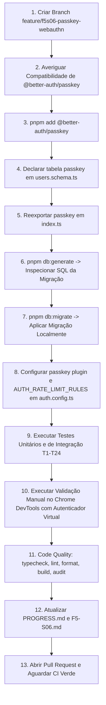

# Plano de Implementação — F5-S06: Passkey (WebAuthn / FIDO2)

**Fase:** F5 — Produção · 5º dos 6 sprints de blindagem de segurança (D-49)  
**Branch:** `feature/f5s06-passkey-webauthn`  
**Depende de:** `F5-S05` (Two Factor Authentication concluído)  
**Entrega:** R41–R45 · Resolução do GAP-03 e fechamento da metade Passkey do GAP-09  
**Decisões e Specs Normativas:**

- [`.agents/memory/DECISIONS.md`](file:///.agents/memory/DECISIONS.md) (`D-54`, `D-32`, `D-40`, `D-31`, `D-49`, `D-50`)
- [`docs/specs/08-blindagem-de-seguranca.md`](file:///docs/specs/08-blindagem-de-seguranca.md) (§6.3, §7.2, §3.3)
- [`docs/specs/02-modelo-de-dados.md`](file:///docs/specs/02-modelo-de-dados.md)
- [`docs/specs/07-protocolo-dos-agentes.md`](file:///docs/specs/07-protocolo-dos-agentes.md)
- [`docs/sprints/fase-5-producao/F5-S06-passkey-webauthn.md`](file:///docs/sprints/fase-5-producao/F5-S06-passkey-webauthn.md)

---

## 1. Diagnóstico e Confirmações Prévias da Biblioteca (§5.1)

O sprint F5-S06 introduz a **única dependência nova de produção** de toda a fase de blindagem: `@better-auth/passkey`.  
Conforme estipulado em `D-54` e reforçado no sprint brief (§5.1), nenhuma alteração de código ou schema deve ser feita antes de averiguar e documentar a compatibilidade exata entre o pacote instalado e o ecossistema.

### 1.1 Versão Atual e Matriz de Compatibilidade

- **Versão do núcleo instalada:** `better-auth@1.7.2` (fixada e validada em F5-S05 / D-40).
- **Pacote a instalar:** `@better-auth/passkey`.
- **Procedimento prévio à instalação:**
  1. Inspecionar versões publicadas no registro npm:
     ```bash
     pnpm view @better-auth/passkey versions --json | tail -20
     pnpm view @better-auth/passkey peerDependencies
     ```
  2. Confirmar que a versão selecionada declara compatibilidade com `better-auth@1.7.2`.
  3. Instalação estrita:
     ```bash
     pnpm add @better-auth/passkey
     ```
  4. Conferência da política de build de dependências (`D-32`):
     - Caso o pnpm interrompa a instalação com `ERR_PNPM_IGNORED_BUILDS`, verificar se o `@better-auth/passkey` ou alguma dependência transitiva possui scripts de ciclo de vida (`postinstall`). Se necessário, registrar a liberação pontual em `package.json` sob a política `D-32` e documentar em `.agents/memory/F5-S06.md`.

### 1.2 Inspeção de Tipos e Assinatura do Plugin

Após a instalação, inspecionar a interface exportada em `node_modules/@better-auth/passkey/dist/index.d.ts`:

```bash
grep -rn "export.*passkey" node_modules/@better-auth/passkey/dist/index.d.ts
grep -rn "rpID\|rpName\|requireSession\|aaguid" node_modules/@better-auth/passkey/dist/*.d.ts | head -20
```

- **Assinatura esperada:**
  ```ts
  import { passkey } from '@better-auth/passkey';

  passkey({
    rpID: string,
    rpName: string,
    origin: string,
  });
  ```
- **Verificação de divergência:** Se a assinatura ou opções exportadas divergirem do previsto nas specs, a execução para imediatamente para reporte ao engenheiro responsável (Staff/Dono).

---

## 2. GAPs Alvo e Resolução Arquitetural

| GAP                           | Severidade | Descrição do Problema                                                                                                                                                                | Resolução Arquitetural em F5-S06                                                                                                                                                                     |
| :---------------------------- | :--------- | :----------------------------------------------------------------------------------------------------------------------------------------------------------------------------------- | :--------------------------------------------------------------------------------------------------------------------------------------------------------------------------------------------------- |
| **GAP-03**                    | ALTO       | Ausência de autenticação resistente a phishing (WebAuthn / FIDO2). Credenciais baseadas em senha e até mesmo OTPs de 2FA são vulneráveis a interception proxies e engenharia social. | Integração do plugin `@better-auth/passkey` com Better Auth, viabilizando autenticação WebAuthn/FIDO2 sem senha via biometria ou chaves de segurança físicas (R41–R45).                              |
| **GAP-09** _(metade Passkey)_ | MÉDIO      | Falta de integridade referencial estrita e unicidade de credenciais no schema do Better Auth.                                                                                        | Modelagem da tabela `passkey` no PostgreSQL via Drizzle com constraint `UNIQUE(credential_id)`, coluna `aaguid`, chave estrangeira `user_id` com `ON DELETE CASCADE` e índice `passkey_user_id_idx`. |

### O que NÃO faz parte deste Sprint

- **Fluxo passkey-first:** Registro de passkey sem sessão prévia é proibido por `D-54`. O registro exige sessão ativa (`registration.requireSession: true`) para evitar reabertura de enumeração de contas.
- **Autofill condicional (`mediation: 'conditional'`):** Focado no cliente Web/Mobile, não afeta os contratos de API.
- **Sincronização multi-dispositivo:** Responsabilidade do provedor de credenciais da plataforma (Apple Keychain, Google Password Manager, Bitwarden).
- **Cliente Flutter:** Implementação mobile será realizada em fase posterior.

---

## 3. Contratos de API e Rotas Entregues (R41–R45)

Todas as rotas de Passkey são montadas sob o prefixo canônico do Better Auth (`/api/auth/`):

| Contrato | Método HTTP & Rota                         | Sessão Exigida | Descrição / Comportamento                                                                                                                                                                                        |
| :------- | :----------------------------------------- | :------------: | :--------------------------------------------------------------------------------------------------------------------------------------------------------------------------------------------------------------- |
| **R41**  | `POST /api/auth/sign-in/passkey`           |    **Não**     | Início e conclusão do fluxo de login sem senha com biometria ou chave de segurança. Gera o desafio WebAuthn ou valida a resposta de autenticação. Protegido por rate limit dedicado.                             |
| **R42**  | `POST /api/auth/passkey/add-passkey`       |    **Sim**     | Inicia e valida o registro de uma nova passkey vinculada à conta do usuário autenticado. Retorna 401 se não autenticado.                                                                                         |
| **R43**  | `GET /api/auth/passkey/list-user-passkeys` |    **Sim**     | Retorna a lista de credenciais cadastradas pertencentes **exclusivamente** ao usuário da sessão atual.                                                                                                           |
| **R44**  | `POST /api/auth/passkey/delete-passkey`    |    **Sim**     | Remove uma credencial de passkey da conta. **Atenção:** o método HTTP é `POST` (conforme convenção nativa da lib). Aplica regra `D-31`: se o ID pertencer a outro usuário, responde `404 Not Found` (nunca 403). |
| **R45**  | `POST /api/auth/passkey/update-passkey`    |    **Sim**     | Atualiza o nome/rótulo amigável da credencial. Aplica `D-31`: se pertencer a outro usuário, responde `404 Not Found`.                                                                                            |

> [!IMPORTANT]
> **Compatibilidade de Roteamento no Fastify:**  
> O manipulador coringa existente em `src/modules/auth/auth.plugin.ts` já escuta os métodos `['GET', 'POST', 'OPTIONS']` para a rota `/api/auth/*`. Como `delete-passkey` e `update-passkey` são requisições `POST`, **nenhuma modificação é necessária em `auth.plugin.ts`**. É expressamente proibido alterar os métodos da rota coringa para adicionar `DELETE`.

---

## 4. Blast Radius Estrito

### 4.1 Arquivos a Criar

1. `drizzle/0004_*.sql` (ou numeração sequencial subsequente): Migração Drizzle tipada gerada via `pnpm db:generate`.
2. `tests/unit/modules/auth/passkey-config.test.ts`: Testes unitários de isolamento para derivação de `rpID`, `origin` e parâmetros de configuração (T1–T5).
3. `tests/integration/schema-passkey.test.ts`: Testes de integração em PostgreSQL efêmero para validar DDL, constraints `UNIQUE`, `ON DELETE CASCADE` e índice (T6–T12).
4. `tests/integration/auth-passkey.test.ts`: Testes de integração HTTP cobrindo endpoints de autenticação, isolamento de inquilino (D-31), bloqueio de não autenticado e integridade de sessão (T13–T22).
5. `docs/agents-plans/plan-f5-s06-passkey-webauthn.md`: Este documento de planejamento versionado.

### 4.2 Arquivos a Editar

1. `package.json`: Adição da dependência `@better-auth/passkey` em `dependencies`.
2. `src/db/schema/users.schema.ts`: Declaração da tabela `passkey` compatível com Better Auth e Drizzle ORM.
3. `src/db/schema/index.ts`: Reexportação da entidade `passkey` no barrel do schema.
4. `src/modules/auth/auth.config.ts`:
   - Importação e registro do plugin `passkey({...})`.
   - Adição da regra de rate limiting `'/sign-in/passkey': { window: 60, max: 10 }` no objeto `AUTH_RATE_LIMIT_RULES` (atingindo as 13 regras mandatórias da Spec 08 §3.3).
5. `.agents/memory/PROGRESS.md`: Atualização de status da sprint F5-S06 para concluída (`✅`), registro dos contratos R41–R45 e avanço para F5-S07.
6. `.agents/memory/F5-S06.md`: Registro factual detalhado do sprint (versão instalada, SQL de migração, resultados dos testes e runbook executado).

### 4.3 Arquivos Intocáveis (Proibido Alterar)

- `src/modules/auth/auth.plugin.ts` (a rota coringa já atende `GET`, `POST`, `OPTIONS`).
- `src/config/env.ts` (`D-54` proíbe terminantemente criar variáveis de ambiente como `RP_ID`; derivação obrigatória de `BETTER_AUTH_URL`).
- `src/app.ts`, `src/server.ts`, `src/plugins/**`.
- `src/modules/{users,artists,tracks,playlists,favorites}/**`.
- Arquivos de migração anteriores em `drizzle/` (`0000_*`, `0001_*`, `0002_*`, `0003_*`).
- `.agents/memory/DECISIONS.md` (`D-54` já foi escrita e é a fonte normativa; não criar novas decisões a menos que ocorra exceção autorizada).
- `tests/e2e/**` (não devem ser modificados; servem como salvaguarda de não-regressão).

---

## 5. Detalhamento Passo a Passo da Implementação



### Passo 1: Criação e Chaveamento de Branch

Garantir que a base de trabalho está limpa e sincronizada com `develop`:

```bash
git checkout develop
git pull origin develop
git checkout -b feature/f5s06-passkey-webauthn
```

### Passo 2: Instalação e Auditoria da Dependência (§5.1)

Executar verificação de compatibilidade com `better-auth@1.7.2`:

```bash
pnpm view @better-auth/passkey peerDependencies
pnpm add @better-auth/passkey
```

Verificar se `node_modules/@better-auth/passkey/dist/index.d.ts` exporta `passkey` e checar se há exigência de build scripts conforme `D-32`.

### Passo 3: Modelagem da Tabela `passkey` (`src/db/schema/users.schema.ts`)

Adicionar a definição canônica da tabela `passkey` ao final de `src/db/schema/users.schema.ts`:

```typescript
export const passkey = pgTable(
  'passkey',
  {
    id: text('id').primaryKey(),
    name: text('name'),
    publicKey: text('public_key').notNull(),
    userId: text('user_id')
      .notNull()
      .references(() => user.id, { onDelete: 'cascade' }),
    credentialID: text('credential_id').notNull().unique(), // D-54 — obrigatório
    counter: integer('counter').notNull().default(0),
    deviceType: text('device_type').notNull(),
    backedUp: boolean('backed_up').notNull().default(false),
    transports: text('transports'),
    aaguid: text('aaguid'), // D-54 — consumido pelo plugin
    createdAt: timestamp('created_at').notNull().defaultNow(),
  },
  (t) => [index('passkey_user_id_idx').on(t.userId)],
);
```

**Justificativas Técnicas dos Campos (`D-54` & Spec 08 §6.3):**

- `credentialID` (`credential_id`): Identificador único global da credencial gerado pelo autenticador. A restrição `UNIQUE` impede que a mesma chave física seja associada a contas distintas ou duplicada.
- `aaguid`: Authenticator Attestation Globally Unique Identifier (16 bytes em formato UUID texto ou nulo). Usado para identificar modelo e fabricante do autenticador de segurança.
- `userId` (`user_id`): Chave estrangeira referenciando `user.id` com `ON DELETE CASCADE`. Se a conta for excluída (ex: `DELETE /api/v1/me`), todas as passkeys vinculadas são deletadas automaticamente em cascata.
- `publicKey` (`public_key`): Chave pública codificada para verificação criptográfica da assinatura FIDO2.
- `counter`: Contador de uso para detecção de clonagem de autenticador.
- `deviceType` (`device_type`): `singleDevice` (chave de hardware) ou `multiDevice` (passkey sincronizada via nuvem).
- `backedUp` (`backed_up`): Indica se a chave está em backup no provedor de identidade.
- `transports`: Lista serializada dos meios de comunicação suportados (`usb`, `nfc`, `ble`, `internal`).

### Passo 4: Reexportação no Barrel (`src/db/schema/index.ts`)

Atualizar `src/db/schema/index.ts` para incluir a nova tabela:

```typescript
import { passkey, twoFactor, user } from './users.schema.js';
// ...
export * from './users.schema.js';
```

> O `drizzleAdapter` do Better Auth recebe `* as schema`. Caso a tabela `passkey` não seja reexportada no barrel, o adapter não a localizará, causando falha em tempo de execução.

### Passo 5: Geração e Aplicação da Migração Drizzle

1. Gerar o arquivo SQL versionado:
   ```bash
   pnpm db:generate
   ```
2. **Auditoria Obrigatória do SQL Gerado:**  
   Inspecionar o arquivo criado em `drizzle/0004_*.sql`. Deve conter **exclusivamente**:
   ```sql
   CREATE TABLE "passkey" (
     "id" text PRIMARY KEY NOT NULL,
     "name" text,
     "public_key" text NOT NULL,
     "user_id" text NOT NULL,
     "credential_id" text NOT NULL,
     "counter" integer DEFAULT 0 NOT NULL,
     "device_type" text NOT NULL,
     "backed_up" boolean DEFAULT false NOT NULL,
     "transports" text,
     "aaguid" text,
     "created_at" timestamp DEFAULT now() NOT NULL,
     CONSTRAINT "passkey_credential_id_unique" UNIQUE("credential_id")
   );
   --> statement-breakpoint
   ALTER TABLE "passkey" ADD CONSTRAINT "passkey_user_id_user_id_fk" FOREIGN KEY ("user_id") REFERENCES "public"."user"("id") ON DELETE cascade ON UPDATE no action;
   --> statement-breakpoint
   CREATE INDEX "passkey_user_id_idx" ON "passkey" USING btree ("user_id");
   ```
3. Aplicar a migração localmente:
   ```bash
   pnpm db:migrate
   ```
4. Conferência com o CLI do Better Auth:
   ```bash
   pnpm dlx @better-auth/cli@latest generate --config src/modules/auth/auth.config.ts
   ```
   Deve retornar **zero diferenças** em relação ao schema Drizzle declarado.

### Passo 6: Configuração no Better Auth (`src/modules/auth/auth.config.ts`)

Editar `src/modules/auth/auth.config.ts`:

1. Importar o plugin de passkey:

   ```typescript
   import { passkey } from '@better-auth/passkey';
   ```

2. Atualizar `AUTH_RATE_LIMIT_RULES` com a 13ª regra canônica (Spec 08 §3.3):

   ```typescript
   export const AUTH_RATE_LIMIT_RULES = {
     // ... 12 regras pré-existentes ...
     '/two-factor/send-otp': { window: 3600, max: 5 },
     '/two-factor/verify-backup-code': { window: 3600, max: 5 },
     // passkey — F5-S06
     '/sign-in/passkey': { window: 60, max: 10 },
   } as const;
   ```

3. Registrar o plugin no array `plugins` com derivação estrita de domínio (`D-54`):
   ```typescript
   plugins: [
     twoFactor({
       // ... configuração F5-S05 ...
     }),
     passkey({
       rpID: new URL(env.BETTER_AUTH_URL).hostname,
       rpName: 'Cardoso Sound',
       origin: env.BETTER_AUTH_URL,
     }),
     bearer(),
     forgetPasswordPlugin(),
   ],
   ```

**Invariantes Técnicas da Configuração (`D-54`):**

- **`rpID`:** Obtido via `new URL(env.BETTER_AUTH_URL).hostname`. Em desenvolvimento (`http://localhost:3333`), resulta em `'localhost'`. Em produção (`https://api.cardososound.com`), resulta em `'api.cardososound.com'`. Não deve conter portas (`:3333`), barras (`/`) ou esquemas (`http://`).
- **`origin`:** Exatamente igual a `env.BETTER_AUTH_URL` sem barra final (`http://localhost:3333`).
- **`registration.requireSession: true`:** Mantido com o comportamento seguro padrão exigido por `D-54` para evitar enumeração de usuários.

---

## 6. Estratégia Abrangente de Testes (T1 a T24)

### 6.1 Testes Unitários de Configuração (`tests/unit/modules/auth/passkey-config.test.ts`)

Testa isoladamente as regras de derivação de domínio e parâmetros do plugin sem dependência de banco ou rede:

|  Caso  | Cenário / Entrada                                                  | Asserção / Resultado Esperado                                                                                                   |
| :----: | :----------------------------------------------------------------- | :------------------------------------------------------------------------------------------------------------------------------ |
| **T1** | `rpID` derivado de URL local `http://localhost:3333`               | Deve retornar estritamente `'localhost'`.                                                                                       |
| **T2** | `rpID` derivado de URL de produção `https://api.cardososound.com`  | Deve retornar estritamente `'api.cardososound.com'`.                                                                            |
| **T3** | Validação sintática do `rpID`                                      | Garantir que o valor derivado nunca contenha dois-pontos (`:`), barra (`/`) nem prefixo de protocolo (`http://` ou `https://`). |
| **T4** | `origin` derivado de `BETTER_AUTH_URL`                             | Deve ser rigorosamente idêntico a `env.BETTER_AUTH_URL`, rejeitando barra final `/`.                                            |
| **T5** | Validação de invariante de segurança `registration.requireSession` | Garantir conformidade com `D-54` (apenas usuários autenticados podem registrar passkey).                                        |

### 6.2 Testes de Integração de Schema (`tests/integration/schema-passkey.test.ts`)

Executados contra o container efêmero PostgreSQL do Testcontainers:

|  Caso   | Cenário / Operação                                                | Asserção / Resultado Esperado                                                             |
| :-----: | :---------------------------------------------------------------- | :---------------------------------------------------------------------------------------- |
| **T6**  | Inspeção da tabela `passkey` no `information_schema.columns`      | Tabela existe e contém as 11 colunas canônicas tipadas.                                   |
| **T7**  | Inspeção de constraints em `information_schema.table_constraints` | Coluna `credential_id` possui restrição `UNIQUE` (`passkey_credential_id_unique`).        |
| **T8**  | Inserção direta de duas linhas com o mesmo `credential_id`        | O PostgreSQL rejeita a segunda inserção com código de erro `23505` (`unique_violation`).  |
| **T9**  | Inspeção da coluna `aaguid`                                       | A coluna existe, é do tipo `text` e aceita valores nulos conforme especificação WebAuthn. |
| **T10** | Inspeção de chave estrangeira de `passkey.user_id`                | FK apontando para `user(id)` com regra referencial `ON DELETE CASCADE`.                   |
| **T11** | Inspeção de índices em `pg_indexes`                               | Índice `passkey_user_id_idx` está presente na coluna `user_id`.                           |
| **T12** | Comparação com `@better-auth/cli generate`                        | O CLI do Better Auth valida o schema sem apontar drift ou colunas ausentes.               |

### 6.3 Testes de Integração de Autenticação (`tests/integration/auth-passkey.test.ts`)

Executados via `app.inject()` contra o servidor Fastify e Better Auth:

|  Caso   | Cenário / Operação                                                                                              | Asserção / Resultado Esperado                                                                                                    |
| :-----: | :-------------------------------------------------------------------------------------------------------------- | :------------------------------------------------------------------------------------------------------------------------------- |
| **T13** | `POST /api/auth/passkey/add-passkey` sem cookie/bearer de sessão                                                | HTTP **401 Unauthorized** (prova eficácia do `requireSession: true`).                                                            |
| **T14** | `GET /api/auth/passkey/list-user-passkeys` com usuário recém-criado sem passkeys                                | HTTP **200 OK** com array vazio `[]`.                                                                                            |
| **T15** | Usuário B tenta executar `POST /api/auth/passkey/delete-passkey` fornecendo o ID de credencial do Usuário A     | HTTP **404 Not Found**, **nunca 403** (cumprimento estrito de `D-31` e spec `03` §7).                                            |
| **T16** | Usuário B tenta executar `POST /api/auth/passkey/update-passkey` para alterar o nome da credencial do Usuário A | HTTP **404 Not Found**, **nunca 403** (`D-31`).                                                                                  |
| **T17** | Verificação de integridade no banco após T15 e T16                                                              | A linha do Usuário A permanece inalterada e ativa no PostgreSQL.                                                                 |
| **T18** | `POST /api/auth/sign-in/passkey` com payload vazio ou malformado                                                | Retorna status **4xx** formatado em envelope RFC 7807, sem causar crash HTTP 500.                                                |
| **T19** | Inspeção do payload do desafio de autenticação emitido pelo backend                                             | O campo `rpId` presente no payload WebAuthn corresponde perfeitamente ao hostname derivado.                                      |
| **T20** | Exclusão de conta via `DELETE /api/v1/me` para um usuário que possui registro em `passkey`                      | Retorna HTTP **204 No Content**; verificação direta no banco confirma que o registro na tabela `passkey` foi purgado em cascata. |
| **T21** | Auditoria de vazamento de dados em endpoints de listagem                                                        | A resposta de `list-user-passkeys` não expõe campos sensíveis internos ou dados de terceiros.                                    |
| **T22** | Teste de não-regressão de autenticação primária                                                                 | Usuário sem passkey continua se autenticando normalmente via senha e 2FA sem nenhum impacto.                                     |

### 6.4 Testes de Determinismo e E2E (T23 a T24)

|  Caso   | Escopo                                             | Critério de Sucesso                                                                                            |
| :-----: | :------------------------------------------------- | :------------------------------------------------------------------------------------------------------------- |
| **T23** | Execução da suíte completa de testes (`pnpm test`) | 100% dos testes unitários e de integração verdes.                                                              |
| **T24** | Teste de determinismo sob ordenação aleatória      | `pnpm vitest run --sequence.shuffle` concluído com zero falhas, provando independência de estado entre testes. |

---

## 7. Runbook de Verificação Manual em Navegador (§7)

Como WebAuthn depende da interação de um autenticador no navegador (API `navigator.credentials`), o caminho feliz completo de registro e login com desafio criptográfico é validado manualmente no Chrome via **Virtual Authenticator Environment** do DevTools.

```bash
# 1. Subir a infraestrutura local
docker compose up -d postgres
pnpm dev
```

### Roteiro de Teste no Navegador (Chrome):

1. **Ativar o Autenticador Virtual:**
   - Abrir o Chrome e acessar `http://localhost:3333/docs`.
   - Pressionar `F12` (DevTools) → clicar no menu de opções `⋮` (canto superior direito do DevTools) → **More tools** → **WebAuthn**.
   - Marcar o checkbox **Enable virtual authenticator environment**.
   - Configurações do autenticador virtual:
     - Protocol: `ctap2`
     - Transport: `internal`
     - User verification: Suportado e ativado.

2. **Autenticação Prévia (Sessão Ativa):**
   - No Swagger UI ou via console, autenticar com um usuário de teste (ex: `joao@cardososound.com` / senha do seed).
   - Confirmar que o cookie de sessão `better-auth.session_token` está registrado no navegador.

3. **Registrar Passkey (`POST /api/auth/passkey/add-passkey`):**
   - Executar a chamada via client do Better Auth ou console do navegador:
     ```javascript
     // Chamada simulada no console do navegador
     const res = await fetch('/api/auth/passkey/add-passkey', {
       method: 'POST',
       headers: { 'Content-Type': 'application/json' },
       body: JSON.stringify({ name: 'Chave DevTools MacBook' }),
     });
     console.log(await res.json());
     ```
   - O DevTools Virtual Authenticator interceptará a criação de credenciais e responderá automaticamente.
   - Confirmar resposta HTTP 200.

4. **Conferência no PostgreSQL:**
   - Conectar ao banco e verificar o registro:
     ```sql
     SELECT id, name, user_id, device_type, backed_up, aaguid, created_at FROM passkey;
     ```
   - Validar que `aaguid` e `device_type` foram persistidos corretamente.

5. **Testar Sign-in com Passkey (`POST /api/auth/sign-in/passkey`):**
   - Fazer logout (`POST /api/auth/sign-out`) e limpar cookies.
   - Disparar o fluxo de autenticação sem senha:
     ```javascript
     const res = await fetch('/api/auth/sign-in/passkey', {
       method: 'POST',
       headers: { 'Content-Type': 'application/json' },
       body: JSON.stringify({}),
     });
     ```
   - O DevTools assinará o desafio com a chave privada virtual.
   - Confirmar HTTP 200 e recebimento do novo cookie de sessão.

6. **Listagem e Exclusão:**
   - `GET /api/auth/passkey/list-user-passkeys` → retorna a chave criada.
   - `POST /api/auth/passkey/delete-passkey` enviando o `id` da credencial → retorna HTTP 200 e a linha é deletada do PostgreSQL.

---

## 8. Armadilhas Conhecidas e Mitigações

|   #    | Armadilha Potencial                              | Causa Raiz / Impacto                                                                                                                                | Mitigação Arquitetural Rigorosa                                                                                                                                        |
| :----: | :----------------------------------------------- | :-------------------------------------------------------------------------------------------------------------------------------------------------- | :--------------------------------------------------------------------------------------------------------------------------------------------------------------------- |
| **1**  | **`rpID` com esquema, porta ou barra**           | `http://localhost:3333` ou `localhost:3333` são rejeitados pelo navegador na especificação WebAuthn, causando erro `SecurityError`.                 | Utilizar `new URL(env.BETTER_AUTH_URL).hostname`, que extrai estritamente o host (ex: `'localhost'` ou `'api.cardososound.com'`). Teste unitário T1/T3 blinda a regra. |
| **2**  | **`origin` com barra final**                     | `http://localhost:3333/` causa mismatch na verificação da assinatura do clientDataJSON.                                                             | `origin` deve ser `env.BETTER_AUTH_URL` sem barra ao final. Teste unitário T4 assegura a formatação exata.                                                             |
| **3**  | **`rpID` fixo hardcoded**                        | Usar `'localhost'` fixo impede o funcionamento em staging/produção, ou credenciais registradas em dev se tornam incompatíveis em prod.              | Derivação dinâmica a partir de `env.BETTER_AUTH_URL`, sem criar nova variável de ambiente (`D-54`).                                                                    |
| **4**  | **Acesso via IP em vez de `localhost`**          | Acessar a API por `http://127.0.0.1:3333` invalida o contexto WebAuthn, pois navegadores tratam apenas `localhost` como origem segura HTTP sem TLS. | Validação e documentação obrigando o uso exclusivo de `localhost` em desenvolvimento local.                                                                            |
| **5**  | **Mock de autenticador em testes automatizados** | Criar mocks sintéticos para WebAuthn mascara incompatibilidades da biblioteca real e gera falso senso de segurança.                                 | Testes automatizados focam em contratos de API, D-31, schema e rejeição 401/404; o fluxo WebAuthn feliz completo é reservado para a validação manual (§7).             |
| **6**  | **Esquecer `UNIQUE(credential_id)`**             | Falta de unicidade permite que a mesma chave física seja associada a dois usuários, criando ambiguidade no sign-in passwordless.                    | Constraint `unique()` mandatória na coluna `credential_id` no schema Drizzle (`D-54`), validada pelo teste T7 e T8 (`23505`).                                          |
| **7**  | **Esquecer reexportação no barrel**              | Se `passkey` não for exportado em `src/db/schema/index.ts`, o `drizzleAdapter` falhará em tempo de execução ao tentar consultar a tabela.           | Atualização explícita do barrel no Passo 4 e validação com T12.                                                                                                        |
| **8**  | **`requireSession: false` no registro**          | Permitir registro sem sessão ativa reabre a enumeração de usuários fechada em F5-S03.                                                               | `registration.requireSession: true` é fixado por `D-54` e comprovado pelo teste T13 (rejeição com 401).                                                                |
| **9**  | **Alterar métodos da coringa do Fastify**        | Supor erroneamente que `delete-passkey` usa método `DELETE` e editar `auth.plugin.ts`.                                                              | O Better Auth implementa `delete-passkey` como `POST`. `auth.plugin.ts` permanece **intocado**.                                                                        |
| **10** | **Retornar 403 em passkey alheia**               | Diferenciar recurso inexistente de recurso alheio viola `D-31` e vaza a existência de contas.                                                       | Toda operação em recurso inexistente ou de outro usuário retorna invariavelmente `404 Not Found`.                                                                      |

---

## 9. Critérios de Aceite e Definition of Done (DoD)

- [ ] **Dependência:** `@better-auth/passkey` instalada e compatível com `better-auth@1.7.2`; `pnpm audit --prod` sem alertas de vulnerabilidade alta ou crítica.
- [ ] **Schema Drizzle:** Tabela `passkey` declarada com as 11 colunas canônicas em `src/db/schema/users.schema.ts` e reexportada em `src/db/schema/index.ts`.
- [ ] **Migração:** Arquivo SQL gerado via `pnpm db:generate`, revisado linha a linha e aplicado via `pnpm db:migrate` (`pnpm db:push` proibido).
- [ ] **Better Auth Config:** Plugin `passkey({...})` ativado com `rpID` e `origin` derivados exclusivamente de `env.BETTER_AUTH_URL` (`D-54`).
- [ ] **Rate Limiting:** Regra `'/sign-in/passkey': { window: 60, max: 10 }` integrada em `AUTH_RATE_LIMIT_RULES`, totalizando as 13 regras da Spec 08 §3.3.
- [ ] **Testes Automatizados:** Suíte T1–T24 verde (`passkey-config.test.ts`, `schema-passkey.test.ts`, `auth-passkey.test.ts`).
- [ ] **Isolamento de Usuário (D-31):** Deleção ou edição de passkey de outro usuário responde estritamente com `404 Not Found`.
- [ ] **Integridade Referencial:** Exclusão de usuário (`DELETE /api/v1/me`) purga registros na tabela `passkey` via `CASCADE`.
- [ ] **Validação Manual (§7):** Registro e login via passkey confirmados no Chrome utilizando o DevTools Virtual Authenticator.
- [ ] **Code Quality Pipeline:**
  - `pnpm typecheck` (zero erros no TypeScript).
  - `pnpm lint` e `pnpm format` aprovados.
  - `pnpm build` (`tsup`) sem inconsistências.
- [ ] **Memória Atualizada:** `.agents/memory/PROGRESS.md` atualizado com contratos R41–R45 e `.agents/memory/F5-S06.md` gerado com todos os achados técnicos.

---

## 10. Próximos Passos Pós-Sprint

Com a entrega de F5-S06, a autenticação por Passkey (GAP-03 e GAP-09) estará concluída. O sprint subsequente será:

- **F5-S07 — Rate Limit Distribuído e Origens Confiáveis:**
  - Implementação de backend Redis para rate limiting compartilhado entre instâncias (GAP-11, GAP-12).
  - Configuração de origens confiáveis e validação distribuída em borda.
