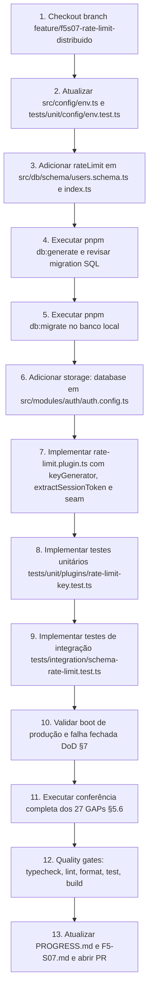

# Plano de Implementação — F5-S07: Rate Limit Distribuído e Origens Confiáveis

**Fase:** F5 — Produção · 6º e último sprint de blindagem de segurança (D-49)  
**Branch:** `feature/f5s07-rate-limit-distribuido`  
**Depende de:** `F5-S06` (Passkey WebAuthn concluído)  
**Entrega:** Resolução dos GAPs 11, 12 e 18 · Encerramento dos 27 GAPs da auditoria de segurança (`docs/issue/AUTHENTICATION.md`)  
**Decisões e Specs Normativas:**

- [`.agents/memory/DECISIONS.md`](file:///.agents/memory/DECISIONS.md) (`D-19`, `D-32`, `D-40`, `D-46-b`, `D-49`, `D-50`, `D-55`, `D-60`)
- [`docs/specs/08-blindagem-de-seguranca.md`](file:///docs/specs/08-blindagem-de-seguranca.md) (§3.2, §3.3, §6.4, §8.2, §8.3, §10)
- [`docs/specs/04-autenticacao-e-seguranca.md`](file:///docs/specs/04-autenticacao-e-seguranca.md) (§4, §6)
- [`docs/specs/07-protocolo-dos-agentes.md`](file:///docs/specs/07-protocolo-dos-agentes.md)
- [`docs/sprints/fase-5-producao/F5-S07-rate-limit-distribuido.md`](file:///docs/sprints/fase-5-producao/F5-S07-rate-limit-distribuido.md)

---

## 1. Diagnóstico e Execução Prévia da §5.1 (Descobertas Factuais)

Conforme instrução estrita da §5.1 do brief e do prompt de abertura, a verificação do suporte a `storage: 'database'` e a inspeção do que `@better-auth/cli generate` produz foram executadas **antes de qualquer código de produção**.

### 1.1 Suporte a `storage: 'database'` na versão instalada (`better-auth@1.7.2`)

1. **Inspecionado no código fonte da biblioteca instalada:**
   - Em `node_modules/@better-auth/core/dist/db/get-tables.mjs:33-56`:
     ```javascript
     const shouldAddRateLimitTable = options.rateLimit?.storage === 'database';
     const rateLimitTable = {
       rateLimit: {
         modelName: options.rateLimit?.modelName || 'rateLimit',
         fields: {
           key: {
             type: 'string',
             unique: true,
             required: true,
             fieldName: options.rateLimit?.fields?.key || 'key',
           },
           count: {
             type: 'number',
             required: true,
             fieldName: options.rateLimit?.fields?.count || 'count',
           },
           lastRequest: {
             type: 'number',
             bigint: true,
             required: true,
             fieldName: options.rateLimit?.fields?.lastRequest || 'lastRequest',
             defaultValue: () => Date.now(),
           },
         },
       },
     };
     ```
   - Em `node_modules/better-auth/dist/api/rate-limiter/index.mjs:76-183`:
     A função `createDatabaseStorageWrapper(ctx)` opera diretamente sobre a tabela `rateLimit` através do adapter Drizzle (`db.findMany`, `db.create`, `db.incrementOne`, `db.deleteMany`), gerenciando atomicamente as janelas temporais e expurgo de tuplas expiradas.
   - **Resultado:** O suporte a `storage: 'database'` **existe nativamente** e está 100% ativo e funcional no `better-auth@1.7.2`.

### 1.2 Tabela Exata Produzida pelo `@better-auth/cli generate`

A execução de teste via CLI (`pnpm dlx @better-auth/cli@latest generate`) com `provider: "pg"` e `rateLimit: { storage: "database" }` gerou a seguinte modelagem Drizzle canônica:

```typescript
export const rateLimit = pgTable('rate_limit', {
  id: text('id').primaryKey(),
  key: text('key').notNull().unique(),
  count: integer('count').notNull(),
  lastRequest: bigint('last_request', { mode: 'number' }).notNull(),
});
```

- **Nome da tabela no PostgreSQL:** `rate_limit` (em `snake_case`).
- **Colunas:**
  - `id`: `text('id').primaryKey()` — chave primária textual padrão do Better Auth.
  - `key`: `text('key').notNull().unique()` — chave única identificadora da rota/IP/entidade.
  - `count`: `integer('count').notNull()` — contador inteiro de requisições na janela.
  - `last_request`: `bigint('last_request', { mode: 'number' }).notNull()` — timestamp em milissegundos persistido como bigint e mapeado para number em memória.
- **Relacionamentos:** Nenhum (tabela utilitária desvinculada de `user_id` para permitir limitação de IPs anônimos).

---

## 2. GAPs Alvo e Resolução Arquitetural

| GAP        | Severidade | Descrição do Problema                                                                                                                                                                                                         | Resolução Arquitetural em F5-S07                                                                                                                                                                                                                                                             |
| :--------- | :--------- | :---------------------------------------------------------------------------------------------------------------------------------------------------------------------------------------------------------------------------- | :------------------------------------------------------------------------------------------------------------------------------------------------------------------------------------------------------------------------------------------------------------------------------------------- |
| **GAP-11** | MÉDIO      | O `keyGenerator` do Fastify rate-limit tinha um ramo morto (`req.user?.id`) executado no hook `onRequest`, anterior à resolução de sessão pelo `authPlugin`. Além disso, um cast `as unknown as` mascarava o erro de tipagem. | Implementação pura de `extractSessionToken(headers)` para extrair o token do Bearer ou Cookie sem tocar no banco, compondo a chave `${ip}\|${sha256(token).slice(0, 16)}` para `/api/v1/**` e estritamente `${ip}` para `/api/auth/**`. Sem `as unknown as` e sem `req.user`.                |
| **GAP-12** | MÉDIO      | Contagem em memória nos dois limitadores: com $k$ réplicas na nuvem, o limite efetivo se torna $k \times max$, permitindo multiplicação linear de tentativas por atacantes.                                                   | (1) Ativação de `rateLimit.storage: 'database'` no Better Auth, persistindo contadores no PostgreSQL.<br>(2) Ponto de extensão (_seam_) configurável para Redis no `@fastify/rate-limit` via `RATE_LIMIT_REDIS_URL`, com falha fechada e sem introduzir dependência não aprovada no momento. |
| **GAP-18** | MÉDIO      | `MOBILE_DEEP_LINK` e `CORS_ORIGIN` eram aceitos sem validação estrita de formato no Zod, permitindo wildcards (`*`) ou URIs arbitrárias que comprometiam a blindagem contra open redirect (`trustedOrigins`).                 | Adição de regex estrito em `MOBILE_DEEP_LINK` (`/^[a-z][a-z0-9+.-]*:\/\/[^*\s]*$/`) e validação em `superRefine` para que todo item de `CORS_ORIGIN_LIST` case `/^https?:\/\/[^*\s]+$/` em produção.                                                                                         |

### O que NÃO faz parte deste Sprint (Fronteiras Inegociáveis)

- **Não alterar a ordem de registro do `buildApp()`:** `rateLimitPlugin` deve permanecer antes de `authPlugin` (§5.3 do brief). Alterar essa ordem removeria a proteção da rota coringa `/api/auth/*`.
- **Não instalar `ioredis` nem nenhuma nova dependência em `package.json`:** `D-55` estabelece que o armazenamento compartilhado do Fastify é entregue como **seam/extensão**, não como dependência direta. Instalação exigiria ADR (D-32).
- **Não consultar banco de dados no `keyGenerator`:** `extractSessionToken` deve operar exclusivamente inspecionando cabeçalhos HTTP (`Authorization` e `Cookie`), prevenindo gargalos no caminho crítico de rede.
- **Não relaxar validações de CORS fora de produção:** `D-19` assegura que CORS permissivo em `development` e `test` seja mantido para não quebrar a suíte.

---

## 3. Contratos de Código e Assinaturas Exatas

### 3.1 `src/config/env.ts`

```typescript
// 1. Campo novo e endurecimento no envSchema
const envSchema = z
  .object({
    // ... campos existentes ...
    RATE_LIMIT_REDIS_URL: z.url().optional(),
    MOBILE_DEEP_LINK: z
      .string()
      .regex(/^[a-z][a-z0-9+.-]*:\/\/[^*\s]*$/, 'must be a scheme URL without wildcards')
      .optional(),
  })
  .superRefine((v, ctx) => {
    // Validações existentes em production (RESEND_API_KEY, TRUST_PROXY_HOPS, TRUSTED_PROXIES) ...

    if (v.NODE_ENV === 'production') {
      const corsList = v.CORS_ORIGIN.split(',')
        .map((origin) => origin.trim())
        .filter(Boolean);

      for (const origin of corsList) {
        if (!/^https?:\/\/[^*\s]+$/.test(origin)) {
          ctx.addIssue({
            code: 'custom',
            path: ['CORS_ORIGIN'],
            message: `CORS_ORIGIN item "${origin}" must match https?:// format without wildcards in production`,
          });
        }
      }
    }
  });

// 2. Extensão da interface Env
export interface Env {
  // ... campos existentes ...
  RATE_LIMIT_REDIS_URL?: string;
  MOBILE_DEEP_LINK?: string;
}
```

### 3.2 `src/plugins/rate-limit.plugin.ts`

```typescript
import { createHash } from 'node:crypto';
import type { IncomingHttpHeaders } from 'node:http';
import { createRequire } from 'node:module';
import rateLimit, { type RateLimitPluginOptions } from '@fastify/rate-limit';
import type { FastifyRequest } from 'fastify';
import fp from 'fastify-plugin';
import { env, type Env } from '../config/env.js';

function sha256(data: string): string {
  return createHash('sha256').update(data).digest('hex');
}

/**
 * Extrai o token de sessão do cabeçalho Authorization (Bearer) ou do cookie HTTP.
 * Não consulta banco de dados nem valida assinatura (GAP-11 / Spec 08 §3.2).
 */
export function extractSessionToken(headers: IncomingHttpHeaders): string | null {
  const authHeader = headers.authorization;
  if (typeof authHeader === 'string' && authHeader.startsWith('Bearer ')) {
    const token = authHeader.slice(7).trim();
    if (token) return token;
  }

  const cookieHeader = headers.cookie;
  if (typeof cookieHeader === 'string' && cookieHeader.length > 0) {
    const cookies = cookieHeader.split(';');
    let fallbackToken: string | null = null;

    for (const chunk of cookies) {
      const eq = chunk.indexOf('=');
      if (eq === -1) continue;
      const key = chunk.slice(0, eq).trim();
      const val = chunk.slice(eq + 1).trim();

      if (key === '__Secure-better-auth.session_token' && val) {
        return decodeURIComponent(val);
      }
      if (key === 'better-auth.session_token' && val) {
        fallbackToken = decodeURIComponent(val);
      }
    }
    if (fallbackToken) return fallbackToken;
  }

  return null;
}

/**
 * Gerador de chave do rate limit para Fastify (Spec 08 §3.2).
 * - /api/auth/** -> estritamente req.ip (evita multiplicação de cota em rotas de autenticação)
 * - /api/v1/** -> IP + hash(token) se autenticado, ou apenas IP se anônimo.
 */
export function rateLimitKeyGenerator(req: FastifyRequest): string {
  const ip = req.ip;
  if (req.url.startsWith('/api/auth')) return ip;
  const token = extractSessionToken(req.headers);
  return token ? `${ip}|${sha256(token).slice(0, 16)}` : ip;
}

/**
 * Ponto de extensão para instanciar o cliente Redis dinamicamente (D-55 / §5.4).
 * Se RATE_LIMIT_REDIS_URL for fornecido mas ioredis não estiver instalado, falha de forma fechada e legível.
 */
export function createRedisClient(redisUrl: string): unknown {
  try {
    const require = createRequire(import.meta.url);
    const Redis = require('ioredis');
    return new Redis(redisUrl);
  } catch {
    throw new Error(
      'RATE_LIMIT_REDIS_URL está definida mas `ioredis` não está instalado.\n' +
        'Rode `pnpm add ioredis` e registre o ADR correspondente (D-32).',
    );
  }
}

export function buildRateLimitOptions(config: Env): RateLimitPluginOptions {
  return {
    global: config.NODE_ENV === 'production',
    max: config.RATE_LIMIT_MAX,
    timeWindow: config.RATE_LIMIT_WINDOW,
    allowList: (req: FastifyRequest) => req.url.startsWith('/health'),
    keyGenerator: rateLimitKeyGenerator,
    ...(config.RATE_LIMIT_REDIS_URL
      ? { redis: createRedisClient(config.RATE_LIMIT_REDIS_URL) }
      : {}),
  };
}

export const rateLimitPlugin = fp(
  async (fastify) => {
    await fastify.register(rateLimit, buildRateLimitOptions(env));
  },
  { name: 'rate-limit-plugin' },
);
```

### 3.3 `src/modules/auth/auth.config.ts`

```typescript
rateLimit: {
  enabled: isProduction,
  storage: 'database', // D-55 — contadores persistidos no Postgres
  window: 60,
  max: 10,
  customRules: AUTH_RATE_LIMIT_RULES, // 13 regras completas desde F5-S06
},
```

### 3.4 `src/db/schema/users.schema.ts` e `src/db/schema/index.ts`

```typescript
// src/db/schema/users.schema.ts
export const rateLimit = pgTable('rate_limit', {
  id: text('id').primaryKey(),
  key: text('key').notNull().unique(),
  count: integer('count').notNull(),
  lastRequest: bigint('last_request', { mode: 'number' }).notNull(),
});

export type RateLimit = typeof rateLimit.$inferSelect;
export type NewRateLimit = typeof rateLimit.$inferInsert;
```

---

## 4. Blast Radius Estrito

### 4.1 Arquivos a Criar

1. `drizzle/0005_*.sql`: Migração DDL criando a tabela `rate_limit` e constraint de unicidade.
2. `tests/unit/plugins/rate-limit-key.test.ts`: Testes unitários para `rateLimitKeyGenerator`, `extractSessionToken` e seam Redis (T1–T11, T21–T22).
3. `tests/integration/schema-rate-limit.test.ts`: Testes de integração no PostgreSQL efêmero para DDL, CLI generate conformance, fluxo Better Auth com `storage: 'database'` e proteção contra 429 fora de produção (T23–T26).
4. `docs/agents-plans/plan-f5-s07-rate-limit-distribuido.md`: Este plano formal de execução versionado.

### 4.2 Arquivos a Editar

1. `src/config/env.ts`: Variável `RATE_LIMIT_REDIS_URL`, regex de `MOBILE_DEEP_LINK` e validação estrita de `CORS_ORIGIN_LIST` em produção.
2. `src/plugins/rate-limit.plugin.ts`: Implementação de `extractSessionToken`, `rateLimitKeyGenerator`, `createRedisClient` e `buildRateLimitOptions`.
3. `src/modules/auth/auth.config.ts`: Adição de `storage: 'database'` no bloco `rateLimit`.
4. `src/db/schema/users.schema.ts`: Declaração da tabela `rateLimit`.
5. `src/db/schema/index.ts`: Atualização de comentários/reexportações para cobrir as 12 tabelas.
6. `.env.example`: Adição comentada de `RATE_LIMIT_REDIS_URL`.
7. `tests/unit/config/env.test.ts`: Novos casos de teste T12–T20.
8. `.agents/memory/PROGRESS.md`: Marcação de F5-S07 como concluída (`✅`), registro do encerramento dos 27 GAPs e apontamento de pendência operacional para F5-S08.
9. `.agents/memory/F5-S07.md`: Relatório do sprint com comprovação da §5.1, integridade do `buildApp()`, runbook do Redis e tabela de conferência dos 27 GAPs (§5.6).

### 4.3 Arquivos Intocáveis (Proibido Alterar)

- `src/app.ts`: A ordem de registro de plugins Fastify é estritamente **load-bearing** (rate-limit deve permanecer antes de auth).
- `src/modules/auth/auth.plugin.ts`: A ponte Fetch e o hook de sessão permanecem inalterados.
- `package.json`: Nenhuma dependência adicionada (`ioredis` não deve ser instalado agora).
- Migrações anteriores em `drizzle/` (`0000_*` até `0004_*`).
- `tests/e2e/**`: A suíte E2E serve como guardrail de não-regressão.

---

## 5. Detalhamento Passo a Passo da Implementação



### Passo 1: Preparação do Ambiente e Branch Git

- Criar a branch de trabalho a partir de `develop`:
  ```bash
  git checkout develop && git pull origin develop
  git checkout -b feature/f5s07-rate-limit-distribuido
  ```

### Passo 2: Endurecimento de Configuração e Validações de Ambiente

- Editar `src/config/env.ts`:
  - Adicionar `RATE_LIMIT_REDIS_URL: z.url().optional()`.
  - Adicionar regex em `MOBILE_DEEP_LINK`: `/^[a-z][a-z0-9+.-]*:\/\/[^*\s]*$/`.
  - Em `superRefine`, validar que quando `NODE_ENV === 'production'`, todo item de `CORS_ORIGIN_LIST` casa `/^https?:\/\/[^*\s]+$/`.
- Atualizar `.env.example` com o comentário explicativo sobre `RATE_LIMIT_REDIS_URL`.
- Expandir `tests/unit/config/env.test.ts` com os casos T12 a T20.

### Passo 3: Modelagem da Tabela `rate_limit` e Migração

- Atualizar `src/db/schema/users.schema.ts` com `rateLimit`.
- Atualizar `src/db/schema/index.ts` garantindo que o barrel expõe `rateLimit`.
- Gerar migração:
  ```bash
  pnpm db:generate
  ```
- Inspecionar a migração `drizzle/0005_*.sql` gerada para conferir DDL idêntico ao exigido pelo CLI.
- Aplicar a migração localmente:
  ```bash
  pnpm db:migrate
  ```

### Passo 4: Configuração de `storage: 'database'` no Better Auth

- Em `src/modules/auth/auth.config.ts`, adicionar `storage: 'database'` no bloco `rateLimit`.
- Executar verificação semântica do Better Auth CLI para garantir que não há divergências pendentes:
  ```bash
  printf '\n' | pnpm dlx @better-auth/cli@latest generate --config src/modules/auth/auth.config.ts
  ```

### Passo 5: Refatoração do `rate-limit.plugin.ts`

- Implementar as funções puras exportadas:
  - `extractSessionToken(headers: IncomingHttpHeaders): string | null`
  - `rateLimitKeyGenerator(req: FastifyRequest): string`
  - `createRedisClient(redisUrl: string): unknown`
  - `buildRateLimitOptions(config: Env): RateLimitPluginOptions`
- Garantir que não existam instâncias de `req.user` nem `as unknown as` no arquivo.

### Passo 6: Criação das Suítes de Testes

- Criar `tests/unit/plugins/rate-limit-key.test.ts` cobrindo T1 a T11 e T21 a T22.
- Criar `tests/integration/schema-rate-limit.test.ts` cobrindo T23 a T26 com Testcontainers.

### Passo 7: Validação dos Três Comandos de Boot de Produção (DoD §7)

- Executar `pnpm build`.
- Testar falha de `MOBILE_DEEP_LINK='*'`:
  ```bash
  NODE_ENV=production MOBILE_DEEP_LINK='*' TRUST_PROXY_HOPS=1 TRUSTED_PROXIES=10.0.0.0/8 \
    RESEND_API_KEY=re_x CORS_ORIGIN=https://a.com node dist/server.js
  ```
- Testar falha de `CORS_ORIGIN='*'`:
  ```bash
  NODE_ENV=production CORS_ORIGIN='*' TRUST_PROXY_HOPS=1 TRUSTED_PROXIES=10.0.0.0/8 \
    RESEND_API_KEY=re_x node dist/server.js
  ```
- Testar falha legível de `RATE_LIMIT_REDIS_URL`:
  ```bash
  NODE_ENV=production RATE_LIMIT_REDIS_URL=redis://localhost:6379 \
    TRUST_PROXY_HOPS=1 TRUSTED_PROXIES=10.0.0.0/8 RESEND_API_KEY=re_x \
    CORS_ORIGIN=https://a.com node dist/server.js
  ```

### Passo 8: Conferência de Fechamento da Auditoria (§5.6)

- Percorrer item a item a tabela da Spec 08 §10 e validar que os 27 GAPs foram solucionados entre F5-S02 e F5-S07.

### Passo 9: Portões de Qualidade e Entrega

- Executar suíte completa de qualidade:
  ```bash
  pnpm typecheck && pnpm lint && pnpm format && pnpm test && pnpm build
  pnpm openapi:export -- --check
  ```
- Atualizar documentação de memória (`PROGRESS.md` e `F5-S07.md`).
- Submeter branch, abrir PR e validar CI verde via `gh run watch`.

---

## 6. Mapeamento Completo dos 29 Casos de Teste Obrigatórios

### 6.1 Unitários — `tests/unit/plugins/rate-limit-key.test.ts` (T1–T11, T21–T22)

| #       | Identificador do Teste                      | Cenário / Entrada                                                                      | Expectativa de Comportamento                                                 |
| :------ | :------------------------------------------ | :------------------------------------------------------------------------------------- | :--------------------------------------------------------------------------- |
| **T1**  | `keyGen: auth route with bearer`            | `req.url = '/api/auth/sign-in/email'`, `Authorization: Bearer test_token`              | Retorna exatamente `req.ip` (sem componente de hash do token).               |
| **T2**  | `keyGen: api route anonymous`               | `req.url = '/api/v1/me'`, sem cabeçalho de auth                                        | Retorna exatamente `req.ip`.                                                 |
| **T3**  | `keyGen: api route authenticated`           | `req.url = '/api/v1/me'`, `Authorization: Bearer test_token`                           | Retorna `${ip}\|${hash}` contendo o IP no prefixo.                           |
| **T4**  | `keyGen: distinct tokens same ip`           | Dois tokens distintos sob o mesmo IP na mesma rota `/api/v1/playlists`                 | Produz chaves estritamente diferentes.                                       |
| **T5**  | `keyGen: same token distinct ips`           | Mesmo token de sessão enviado de dois IPs diferentes (`1.1.1.1` e `2.2.2.2`)           | Produz chaves estritamente diferentes.                                       |
| **T6**  | `keyGen: token leak prevention`             | Token sensível `secret_session_bearer_token`                                           | A chave gerada **não contém** a substring do token original.                 |
| **T7**  | `extractToken: valid bearer`                | `headers: { authorization: 'Bearer tok_123' }`                                         | Retorna `'tok_123'`.                                                         |
| **T8**  | `extractToken: session cookie`              | Header `cookie` com `better-auth.session_token` e `__Secure-better-auth.session_token` | Extrai e decodifica corretamente o valor do cookie em ambos os formatos.     |
| **T9**  | `extractToken: missing headers`             | Objeto de headers vazio `{}`                                                           | Retorna `null`.                                                              |
| **T10** | `extractToken: basic auth`                  | `headers: { authorization: 'Basic dXNlcjpwYXNz' }`                                     | Retorna `null` (apenas Bearer é considerado token de sessão).                |
| **T11** | `extractToken: no database access`          | Espião em `pool.query` monitorando chamadas durante `extractSessionToken`              | Nenhuma consulta SQL é executada (zero chamadas).                            |
| **T21** | `redisSeam: without redis url`              | `buildRateLimitOptions` com `RATE_LIMIT_REDIS_URL` ausente                             | Objeto retornado não possui a propriedade `redis`.                           |
| **T22** | `redisSeam: with redis url missing ioredis` | `buildRateLimitOptions` com `RATE_LIMIT_REDIS_URL = 'redis://localhost:6379'`          | Lança exceção com a mensagem exata prescrevendo `pnpm add ioredis` e `D-32`. |

### 6.2 Unitários — `tests/unit/config/env.test.ts` (T12–T20)

| #       | Identificador do Teste               | Cenário / Entrada                                                    | Expectativa de Comportamento                                 |
| :------ | :----------------------------------- | :------------------------------------------------------------------- | :----------------------------------------------------------- |
| **T12** | `env: valid mobile deep link`        | `MOBILE_DEEP_LINK='cardososound://auth'`                             | Valida com sucesso e expõe a propriedade.                    |
| **T13** | `env: wildcard mobile deep link`     | `MOBILE_DEEP_LINK='*'`                                               | Lança `ZodError` informando violação do regex.               |
| **T14** | `env: url wildcard mobile deep link` | `MOBILE_DEEP_LINK='https://evil.example/*'`                          | Lança `ZodError` informando rejeição de wildcard.            |
| **T15** | `env: empty string mobile deep link` | `MOBILE_DEEP_LINK=''`                                                | Lança `ZodError` por não cumprir o formato do esquema.       |
| **T16** | `env: production wildcard cors`      | `NODE_ENV='production'`, `CORS_ORIGIN='*'`                           | Lança `ZodError` citando `CORS_ORIGIN`.                      |
| **T17** | `env: production valid cors list`    | `NODE_ENV='production'`, `CORS_ORIGIN='https://a.com,https://b.com'` | Valida e produz array com 2 elementos em `CORS_ORIGIN_LIST`. |
| **T18** | `env: development wildcard cors`     | `NODE_ENV='development'`, `CORS_ORIGIN='*'`                          | Valida com sucesso (permissivo por D-19).                    |
| **T19** | `env: omitted redis url`             | `RATE_LIMIT_REDIS_URL` não fornecido                                 | Valida e atribui `undefined`.                                |
| **T20** | `env: invalid redis url`             | `RATE_LIMIT_REDIS_URL='nao-e-url'`                                   | Lança `ZodError` por formato de URL inválido.                |

### 6.3 Integração — `tests/integration/schema-rate-limit.test.ts` (T23–T26)

| #       | Identificador do Teste                        | Cenário / Entrada                                                         | Expectativa de Comportamento                                                                |
| :------ | :-------------------------------------------- | :------------------------------------------------------------------------ | :------------------------------------------------------------------------------------------ |
| **T23** | `schema: rate_limit table columns`            | Inspeção de `information_schema.columns` no PostgreSQL do Testcontainers  | Tabela `rate_limit` possui exatamente `id`, `key`, `count` e `last_request` com seus tipos. |
| **T24** | `schema: cli generate conformance`            | Comparação do schema Drizzle da app contra `getAuthTables` do Better Auth | Modelo `rateLimit` coincide 100% com o adapter Drizzle.                                     |
| **T25** | `integration: full auth flow with db storage` | Execução completa de Sign-up -> Verify Email -> Sign-in no Testcontainers | Fluxo responde com sucesso e tuplas são manipuladas na tabela `rate_limit`.                 |
| **T26** | `integration: rate limit disabled in test`    | Execução de 20 chamadas seguidas em rota de sign-in sob `NODE_ENV='test'` | Nenhuma resposta `HTTP 429` é emitida (conforme diretriz D-19).                             |

### 6.4 E2E e Não-Regressão (T27–T29)

| #       | Identificador do Teste                   | Cenário / Entrada                                                           | Expectativa de Comportamento                                      |
| :------ | :--------------------------------------- | :-------------------------------------------------------------------------- | :---------------------------------------------------------------- |
| **T27** | `regression: complete test suite`        | `pnpm test`                                                                 | Todos os testes unitários, de integração e E2E executam verdes.   |
| **T28** | `regression: randomized order execution` | `pnpm vitest run --sequence.shuffle`                                        | Suíte é 100% determinística sem dependência de ordem entre specs. |
| **T29** | `regression: open redirect protection`   | Testes T24 e T25 de F3-S03 (`callbackURL` com URLs externas ou malformadas) | Rejeitados com erro de validação pelo Better Auth `originCheck`.  |

---

## 7. Critérios de Aceite e Definition of Done (DoD)

```bash
# 1. Banco e Migração
docker compose up -d && pnpm db:migrate

# 2. Portões de Qualidade
pnpm typecheck && pnpm lint && pnpm format && pnpm test && pnpm build

# 3. Verificação de Conformance de Schema do Better Auth (diff zero)
printf '\n' | pnpm dlx @better-auth/cli@latest generate --config src/modules/auth/auth.config.ts

# 4. Verificação de Contrato OpenAPI (diff zero)
pnpm openapi:export -- --check

# 5. Validação de Falha Fechada no Boot de Produção
NODE_ENV=production MOBILE_DEEP_LINK='*' TRUST_PROXY_HOPS=1 TRUSTED_PROXIES=10.0.0.0/8 \
  RESEND_API_KEY=re_x CORS_ORIGIN=https://a.com node dist/server.js
# Esperado: [Config Error] citando MOBILE_DEEP_LINK, exit 1

NODE_ENV=production CORS_ORIGIN='*' TRUST_PROXY_HOPS=1 TRUSTED_PROXIES=10.0.0.0/8 \
  RESEND_API_KEY=re_x node dist/server.js
# Esperado: [Config Error] citando CORS_ORIGIN, exit 1

NODE_ENV=production RATE_LIMIT_REDIS_URL=redis://localhost:6379 \
  TRUST_PROXY_HOPS=1 TRUSTED_PROXIES=10.0.0.0/8 RESEND_API_KEY=re_x \
  CORS_ORIGIN=https://a.com node dist/server.js
# Esperado: Exceção explícita citando `pnpm add ioredis` e D-32, exit 1

# 6. Inspeção da Tabela no PostgreSQL
docker compose exec -T postgres psql -U cardoso -d cardoso_sound -c '\d rate_limit'
# Esperado: Exibição das colunas id, key, count, last_request e constraint rate_limit_key_unique
```

### Checklist Final

- [ ] T1–T29 100% verdes.
- [ ] Saída esperada nos 3 comandos de teste de boot em produção.
- [ ] `grep -rn "as unknown as" src/plugins/rate-limit.plugin.ts` vazio.
- [ ] `grep -rn "req.user" src/plugins/rate-limit.plugin.ts` vazio.
- [ ] `git diff src/app.ts` vazio (ordem de registro rigorosamente preservada).
- [ ] `git diff package.json` vazio (nenhuma dependência nova instalada).
- [ ] Chave de rate limit nunca expõe o token em claro (coberto por T6).
- [ ] `AUTH_RATE_LIMIT_RULES` permanece com as 13 regras completas.
- [ ] Migração `0005_*.sql` inspecionada; `pnpm db:push` nunca utilizado.
- [ ] Tabela da Spec 08 §10 conferida com os 27 GAPs entregues.
- [ ] Atualização de `.agents/memory/PROGRESS.md` e `.agents/memory/F5-S07.md`.
