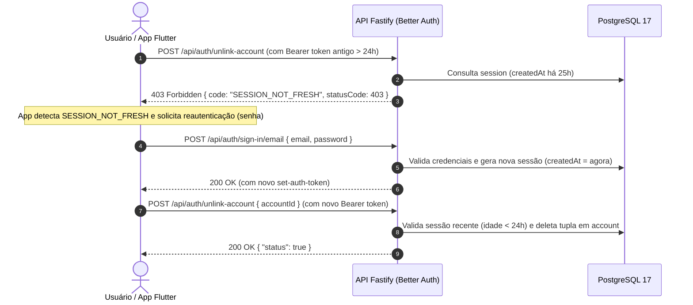
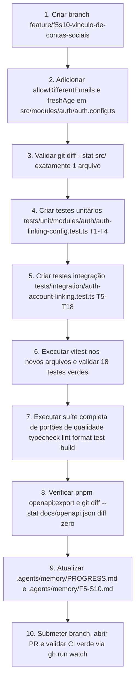

# Plano de Implementação — F5-S10: Vínculo de Contas Sociais (Área Administrativa)

> **Status:** 🟡 Planejamento Concluído · Aguardando Autorização do Usuário (Etapa 3 do Protocolo — ⏸ PARADA 1)  
> **Fase:** F5 — Produção · Executado entre **F5-S07** e **F5-S08** (o número é identidade, não ordem cronológica — [D-49](file:///.agents/memory/DECISIONS.md#d-49), [D-58](file:///.agents/memory/DECISIONS.md#d-58))  
> **Branch Alvo:** `feature/f5s10-vinculo-de-contas-sociais`  
> **Depende de:** `F5-S04` (índice único `account_provider_account_unique`, GAP-16) e `F5-S07` (Rate Limit Distribuído concluído)  
> **Entrega:** Contratos R46, R47, R48 · Decisão [D-58](file:///.agents/memory/DECISIONS.md#d-58) · Fechamento da última superfície não documentada da API  
> **Decisões e Specs Normativas:**
>
> - [`.agents/memory/DECISIONS.md`](file:///.agents/memory/DECISIONS.md) (**D-58**, **D-31**, **D-13**, **D-44**, **D-42**, **D-45**, **D-51**, **D-52**)
> - [`docs/specs/04-autenticacao-e-seguranca.md`](file:///docs/specs/04-autenticacao-e-seguranca.md) (§1.1 e §1.3)
> - [`docs/specs/03-contrato-da-api.md`](file:///docs/specs/03-contrato-da-api.md) (§2 e §5.1)
> - [`docs/specs/05-testes-e-qualidade.md`](file:///docs/specs/05-testes-e-qualidade.md) (Pirâmide e convenções)
> - [`docs/specs/07-protocolo-dos-agentes.md`](file:///docs/specs/07-protocolo-dos-agentes.md) (Protocolo de 7 etapas)
> - [`docs/sprints/fase-5-producao/F5-S10-vinculo-de-contas-sociais.md`](file:///docs/sprints/fase-5-producao/F5-S10-vinculo-de-contas-sociais.md) (Sprint Brief Normativo)

---

## 1. Diagnóstico e Execução Prévia da §5.1 (Descobertas Factuais no Runtime e Banco)

Em estrita conformidade com a §5.1 do sprint brief e o prompt de abertura, as verificações estruturais no runtime instalado (`better-auth@1.7.2` / `@better-auth/core@1.7.2`) e no banco de dados ativo foram executadas **antes de qualquer escrita de código**:

### 1.1 Verificação (a): As Três Rotas Existem e Quais Middlewares Utilizam?

Execução de inspeção em `node_modules/better-auth/dist/api/routes/account.mjs`:

```bash
grep -nE 'createAuthEndpoint\("/(list-accounts|link-social|unlink-account)"' \
  node_modules/better-auth/dist/api/routes/account.mjs
grep -n "freshSessionMiddleware" node_modules/better-auth/dist/api/routes/account.mjs
```

**Resultado factual:**

1. **`GET /list-accounts`** (linha 21): declarada com `use: [sessionMiddleware]`. Requer sessão ativa e devolve as contas vinculadas via `c.context.internalAdapter.findAccounts(session.user.id)`.
2. **`POST /link-social`** (linha 77): declarada com `use: [sessionMiddleware]`. Exige sessão ativa e processa vinculação via `idToken` ou gerando URL de redirecionamento OAuth.
3. **`POST /unlink-account`** (linha 263): declarada com `use: [freshSessionMiddleware]` (linha 266). Exige sessão ativa **e recente** (`freshAge`).

### 1.2 Verificação (b): Leitura de `allowDifferentEmails` e `freshAge` no Runtime

Inspeção de rotas e criação de contexto:

```bash
grep -rn "allowDifferentEmails" node_modules/better-auth/dist/api/routes/ node_modules/better-auth/dist/oauth2/
grep -rn "freshAge" node_modules/better-auth/dist/context/create-context.mjs
```

**Resultado factual:**

1. **`allowDifferentEmails`**:
   - Em `node_modules/better-auth/dist/api/routes/account.mjs:213`:
     ```javascript
     if (
       linkingUserInfo.user.email?.toLowerCase() !== session.user.email.toLowerCase() &&
       c.context.options.account?.accountLinking?.allowDifferentEmails !== true
     )
       throw APIError.from('UNAUTHORIZED', {
         message: 'Account not linked - different emails not allowed',
         code: 'LINKING_DIFFERENT_EMAILS_NOT_ALLOWED',
       });
     ```
   - Em `node_modules/better-auth/dist/api/routes/callback.mjs:177`:
     ```javascript
     if (
       userInfo.email?.toLowerCase() !== link.email.toLowerCase() &&
       c.context.options.account?.accountLinking?.allowDifferentEmails !== true
     )
       return redirectOnError(OAUTH_CALLBACK_ERROR_CODES.EMAIL_DOES_NOT_MATCH);
     ```
   - **Conclusão:** Quando a chave não está ativa (`true`), a tentativa de vincular conta com e-mail distinto resulta em HTTP 401 `LINKING_DIFFERENT_EMAILS_NOT_ALLOWED` no fluxo de `idToken` e redirecionamento de erro no callback. Ativar `allowDifferentEmails: true` resolve exatamente essa restrição.
2. **`freshAge`**:
   - Em `node_modules/better-auth/dist/context/create-context.mjs:148`:
     ```javascript
     freshAge: options.session?.freshAge === void 0 ? 3600 * 24 : options.session.freshAge,
     ```
   - Em `node_modules/better-auth/dist/api/routes/session.mjs:330-334`:
     ```javascript
     if (ctx.context.sessionConfig.freshAge !== 0) {
       const createdAt = new Date(session.session.createdAt).getTime();
       const freshAge = ctx.context.sessionConfig.freshAge * 1e3;
       if (Date.now() - createdAt >= freshAge)
         throw APIError.from('FORBIDDEN', BASE_ERROR_CODES.SESSION_NOT_FRESH);
     }
     ```
   - **Conclusão:** `freshAge` é configurável sob `session.freshAge` em segundos. O valor padrão implícito de 86400 s (24 h) torna-se explícito e contratual ao configurarmos `session.freshAge: 60 * 60 * 24`. Quando a idade da sessão ultrapassa essa janela, `unlinkAccount` responde HTTP 403 `SESSION_NOT_FRESH`.

### 1.3 Verificação (c): O Índice Único de F5-S04 Está Aplicado no Banco?

Execução no PostgreSQL local do Docker:

```bash
docker compose exec -T postgres psql -U cardoso -d cardoso_sound \
  -c "SELECT indexname FROM pg_indexes WHERE tablename = 'account';"
```

**Resultado factual:**

```
            indexname
---------------------------------
 account_pkey
 account_user_id_idx
 account_provider_account_unique
(3 rows)
```

- **Conclusão:** O índice único `account_provider_account_unique` (entregue em F5-S04 / GAP-16) está **ativo e aplicado** no banco de dados. A integridade contra colisões concorrentes de vínculo está garantida no nível de engine relacional.

---

## 2. Natureza da Sprint e Fronteiras Arquiteturais

> **Sprint de política e contrato, não de implementação.**  
> As três rotas (R46, R47, R48) **já respondem hoje** pela rota curinga `fastify.route({ method: ['GET', 'POST', 'OPTIONS'], url: '/api/auth/*', ... })` em [`src/modules/auth/auth.plugin.ts`](file:///src/modules/auth/auth.plugin.ts).

### 2.1 As Cinco Entregas Fundamentais (D-58)

1. **`accountLinking.allowDifferentEmails: true` ([D-58 a](file:///.agents/memory/DECISIONS.md#d-58)):**  
   Permite vincular identidades sociais (Google, GitHub) cujo e-mail primário difere do e-mail cadastrado na conta local, sem retornar `LINKING_DIFFERENT_EMAILS_NOT_ALLOWED`. É o caso mais frequente em desenvolvimento de software (ex: e-mail corporativo no cadastro vs e-mail pessoal no GitHub).
2. **`session.freshAge: 60 * 60 * 24` explícito ([D-58 c](file:///.agents/memory/DECISIONS.md#d-58)):**  
   Formaliza em contrato que a operação de desvinculação (`POST /unlink-account`) exige sessão com menos de 24 horas de emissão, emitindo HTTP 403 `SESSION_NOT_FRESH` quando expirada.
3. **Formalização dos Contratos R46, R47 e R48:**  
   Publicação formal dos comportamentos e envelopes de erro previstos na spec `03` §5.1.
4. **Suíte Completa de Testes Automatizados (T1 a T19):**  
   Cobertura unitária e de integração contra os quatro invariantes essenciais do aplicativo mobile.
5. **Registro Arquitetural Permanente sobre o Facebook ([D-58 b](file:///.agents/memory/DECISIONS.md#d-58)):**  
   Documentação formal de que o Facebook **não vincula contas** (responde `401 LINKING_NOT_ALLOWED`), pois não garante verificação de e-mail neste stack.

### 2.2 O Que NÃO Faz Parte Deste Sprint (Fronteiras Inegociáveis)

- **Nenhum handler novo:** Proibido registrar novos manipuladores para `/list-accounts`, `/link-social` ou `/unlink-account` em Fastify. A rota curinga já trata e a criação de rotas específicas colidiria com [D-45](file:///.agents/memory/DECISIONS.md#d-45).
- **Nenhuma migração relacional:** O banco já possui o índice `account_provider_account_unique`. Proibido alterar schemas em `src/db/schema/**` ou gerar arquivos em `drizzle/`.
- **Nenhuma dependência nova:** `package.json` e `pnpm-lock.yaml` permanecem estritamente intactos.
- **Não incluir `'facebook'` em `trustedProviders`:** Manter rigorosamente `['google', 'github']`. Incluir o Facebook violaria a spec `04` §1.1 e [D-58 (b)](file:///.agents/memory/DECISIONS.md#d-58), expondo o sistema a Account Takeover (ATO).
- **Não alterar `session.cookieCache`:** Preservar `cookieCache: { enabled: true, maxAge: 5 * 60 }` introduzido em F5-S04. `freshAge` é acrescentado como chave adjacente.
- **Não alterar envelopes das specs:** `GET /list-accounts` devolve array cru emitido pelo Better Auth; não tentar encapsular em `{ data, meta }`.

---

## 3. Contratos de Código e Assinaturas Exatas

### 3.1 Alteração Cirúrgica em `src/modules/auth/auth.config.ts`

Apenas duas alterações pontuais em propriedades existentes:

```typescript
// src/modules/auth/auth.config.ts (linhas 125-130 e 153-157)
    account: {
      accountLinking: {
        enabled: true,
        trustedProviders: ['google', 'github'], // INALTERADO — D-58 (b)
        allowDifferentEmails: true,              // NOVO — D-58 (a)
      },
    },
    // ...
    session: {
      expiresIn: 60 * 60 * 24 * 7, // 7 dias em segundos (inalterado)
      updateAge: 60 * 60 * 24,     // 24 horas em segundos (inalterado)
      freshAge: 60 * 60 * 24,      // NOVO — D-58 (c) (24 horas em segundos)
      cookieCache: { enabled: true, maxAge: 5 * 60 }, // PRESERVADO (F5-S04 / GAP-13)
    },
```

Conferência de diff esperado:

```bash
git diff --stat src/
# Esperado: 1 file changed, ~2 insertions(+)
```

### 3.2 Contratos HTTP Normativos (Spec 03 §5.1)

#### R46 · `GET /api/auth/list-accounts`

- **Autenticação:** Obrigatória (`Authorization: Bearer <token>` ou Cookie de sessão). Sem sessão → `401 Unauthorized`.
- **Resposta Sucesso (`200 OK`):** Retorna array JSON cru (da lib) com as contas associadas:
  ```json
  [
    {
      "id": "acc_123",
      "providerId": "credential",
      "accountId": "usr_abc",
      "userId": "usr_abc",
      "issuer": "credential",
      "scopes": [],
      "createdAt": "2026-09-11T12:00:00.000Z",
      "updatedAt": "2026-09-11T12:00:00.000Z"
    }
  ]
  ```
- **Nota Contratual:** O corpo é array plano, **não** `{ data, meta }`. A conta de e-mail/senha local possui `providerId: 'credential'`.
- **Isolamento de Segurança:** Um usuário autenticado B recebe **apenas** suas próprias contas vinculadas. Zero vazamento de registros de outros usuários.

#### R47 · `POST /api/auth/link-social`

- **Autenticação:** Obrigatória. Sem sessão → `401 Unauthorized`.
- **Caminho 1 (Nativo / Mobile via ID Token):**
  ```json
  {
    "provider": "google",
    "idToken": { "token": "<jwt_id_token>" }
  }
  ```
  - `200 OK` → `{ "url": "", "status": true, "redirect": false }`
- **Caminho 2 (Web / Redirect):**
  ```json
  {
    "provider": "google",
    "callbackURL": "cardososound://accounts"
  }
  ```
  - `200 OK` → `{ "url": "https://accounts.google.com/o/oauth2/v2/auth?...", "redirect": true }`
- **Erros Tratados pelo App Flutter (Formatados no envelope RFC 7807 por `toRfc7807`):**
  - `401 Unauthorized` (`code: "LINKING_NOT_ALLOWED"`): Provedor fora de `trustedProviders` ou sem verificação confiável de e-mail. **Resposta permanente para Facebook.**
  - `404 Not Found` (`code: "ID_TOKEN_NOT_SUPPORTED"`): Envio de `idToken` para provedor sem suporte nativo a OpenID ID Token. **Resposta permanente para GitHub.**
  - `404 Not Found` (`code: "PROVIDER_NOT_FOUND"`): Provedor inexistente ou não configurado no servidor.
  - `409 Conflict` (`code: "SOCIAL_ACCOUNT_ALREADY_LINKED"`): A identidade social já está vinculada a outro usuário do sistema.
  - `401 Unauthorized` (`code: "LINKING_DIFFERENT_EMAILS_NOT_ALLOWED"`): **Eliminado**, pois `allowDifferentEmails: true`.

#### R48 · `POST /api/auth/unlink-account`

- **Autenticação:** Obrigatória com sessão recente (`freshAge`). Sem sessão → `401 Unauthorized`.
- **Payload:**
  ```json
  {
    "accountId": "acc_123"
  }
  ```
- **Resposta Sucesso (`200 OK`):** `{ "status": true }`
- **Erros:**
  - `400 Bad Request` (`code: "FAILED_TO_UNLINK_LAST_ACCOUNT"`): Tentativa de remover o último método de autenticação da conta. Garante que nenhum usuário fique trancado sem método de login.
  - `400 Bad Request` (`code: "ACCOUNT_NOT_FOUND"`): `accountId` inexistente **ou pertencente a outro usuário**. Em conformidade estrita com [D-31](file:///.agents/memory/DECISIONS.md#d-31), "inexistente" e "de outro usuário" são indistinguíveis, eliminando vetores de enumeração/IDOR.
  - `403 Forbidden` (`code: "SESSION_NOT_FRESH"`): Sessão com mais de 24 horas de criação.

### 3.3 Protocolo de Step-Up Authentication para o Flutter



Nenhum endpoint dedicado de step-up é criado. O fluxo aproveita a rota canônica R10 (`POST /sign-in/email`).

---

## 4. Blast Radius Estrito

### 4.1 Arquivos a Criar

| Arquivo                                                      | Propósito                                                                       |
| :----------------------------------------------------------- | :------------------------------------------------------------------------------ |
| `tests/unit/modules/auth/auth-linking-config.test.ts`        | Testes unitários T1–T4 verificando opções resolvidas em `createAuth().options`. |
| `tests/integration/auth-account-linking.test.ts`             | Testes de integração T5–T18 via Testcontainers e Fastify `app.inject()`.        |
| `docs/agents-plans/plan-f5-s10-vinculo-de-contas-sociais.md` | Este plano formal de execução versionado (Regra 6 do `AGENTS.md`).              |
| `.agents/memory/F5-S10.md`                                   | Resumo técnico executivo do sprint.                                             |

### 4.2 Arquivos a Editar

| Arquivo                           | Modificação Permitida                                                                                  |
| :-------------------------------- | :----------------------------------------------------------------------------------------------------- |
| `src/modules/auth/auth.config.ts` | Inclusão de `allowDifferentEmails: true` e `freshAge: 60 * 60 * 24` — **NADA MAIS**.                   |
| `docs/openapi.json`               | **Apenas** se `pnpm openapi:export` acusar alteração (esperado: diff zero).                            |
| `.agents/memory/PROGRESS.md`      | Atualização do status de F5-S10 para ✅, próximo F5-S08, e registro de R46–R48 em contratos entregues. |

### 4.3 Arquivos Intocáveis (Proibido Tocar)

- `src/modules/auth/auth.plugin.ts` e `src/modules/auth/auth.routes.ts`
- `src/db/schema/**` e `drizzle/**` (sem migrações)
- `src/config/env.ts` e `src/config/constants.ts`
- `src/app.ts` e `src/server.ts`
- `src/plugins/**`
- `src/modules/{users,playlists,favorites,artists,tracks}/**`
- `package.json` e `pnpm-lock.yaml`
- `docs/specs/**` (especificações já normativas)
- `.agents/memory/DECISIONS.md` (D-58 já vigente)

---

## 5. Mapeamento Detalhado dos 19 Casos de Teste (T1 a T19)

### 5.1 Testes Unitários — `tests/unit/modules/auth/auth-linking-config.test.ts` (T1–T4)

| #      | Identificador do Teste            | Cenário / Entrada                                                    | Expectativa de Comportamento                                                                                            |
| :----- | :-------------------------------- | :------------------------------------------------------------------- | :---------------------------------------------------------------------------------------------------------------------- |
| **T1** | `config: account linking enabled` | `createAuth().options.account?.accountLinking?.enabled`              | Deve ser estritamente `true`.                                                                                           |
| **T2** | `config: allow different emails`  | `createAuth().options.account?.accountLinking?.allowDifferentEmails` | Deve ser estritamente `true` ([D-58 a](file:///.agents/memory/DECISIONS.md#d-58)).                                      |
| **T3** | `config: trusted providers list`  | `createAuth().options.account?.accountLinking?.trustedProviders`     | Deve ser **exatamente** `['google', 'github']` — sem `'facebook'` ([D-58 b](file:///.agents/memory/DECISIONS.md#d-58)). |
| **T4** | `config: session fresh age`       | `createAuth().options.session?.freshAge`                             | Deve ser estritamente `86400` (60 * 60 * 24) ([D-58 c](file:///.agents/memory/DECISIONS.md#d-58)).                      |

### 5.2 Testes de Integração — `tests/integration/auth-account-linking.test.ts` (T5–T18)

Configuração com Testcontainers (`startTestDatabase`), `setPool(testDb.pool)`, e `setAuthInstanceForTest(createAuth({ overrideSocialProviders: { google, github, facebook } }))` permitindo avaliar a recusa do Facebook sem erro 404 de provedor inexistente.

| #       | Identificador do Teste                  | Cenário / Entrada                                                                                                           | Expectativa de Comportamento                                                                                                                                                          |
| :------ | :-------------------------------------- | :-------------------------------------------------------------------------------------------------------------------------- | :------------------------------------------------------------------------------------------------------------------------------------------------------------------------------------ |
| **T5**  | `R46: unauthenticated list`             | `GET /api/auth/list-accounts` sem header de autorização                                                                     | Retorna `HTTP 401 Unauthorized` com envelope de erro RFC 7807.                                                                                                                        |
| **T6**  | `R46: email user list accounts`         | `GET /api/auth/list-accounts` autenticado após sign-up por e-mail/senha                                                     | Retorna `HTTP 200 OK`, array com **1** item contendo `providerId: 'credential'`.                                                                                                      |
| **T7**  | `R46: array body format`                | Inspeção da resposta JSON de T6                                                                                             | O corpo é um **array cru**, sem embrulho em `{ data, meta }`.                                                                                                                         |
| **T8**  | `R46: user isolation`                   | Usuário A com 1 conta; usuário B com 2 contas (credential + google inserido no banco). Executar com Bearer de B             | Devolve apenas as 2 contas de B. Executar com Bearer de A devolve apenas a de A (zero contaminação).                                                                                  |
| **T9**  | `R48: unlink only account rejected`     | `POST /api/auth/unlink-account` passando o `accountId` da única conta existente                                             | Retorna `HTTP 400 Bad Request` com `code: "FAILED_TO_UNLINK_LAST_ACCOUNT"`.                                                                                                           |
| **T10** | `R48: unlink one of two accounts`       | Usuário com 2 contas (credential + google inserido no banco). Enviar `unlink-account` para a conta google                   | Retorna `HTTP 200 OK` `{ "status": true }`. Subsequente `GET /list-accounts` retorna apenas 1 conta.                                                                                  |
| **T11** | `R47: allowDifferentEmails validation`  | Usuário registrado com `user@exemplo.com`. Conta vinculada `providerId: 'github'` associada a ele via banco. Validar R46    | A conta com e-mail/identidade externa aparece listada normalmente. Chamada `POST /link-social` google com payload mock é avaliada sem acionar `LINKING_DIFFERENT_EMAILS_NOT_ALLOWED`. |
| **T12** | `R48: unlink foreign account IDOR-safe` | Usuário A tenta desvincular o `accountId` pertencente ao usuário B                                                          | Retorna `HTTP 400 Bad Request` com `code: "ACCOUNT_NOT_FOUND"`. Nunca 403, nunca vazando existência alheia ([D-31](file:///.agents/memory/DECISIONS.md#d-31)).                        |
| **T13** | `R47: facebook linking rejected`        | `POST /api/auth/link-social` com `{ "provider": "facebook", "idToken": { "token": "dummy" } }`                              | Retorna `HTTP 401 Unauthorized` com `code: "LINKING_NOT_ALLOWED"` ([D-58 b](file:///.agents/memory/DECISIONS.md#d-58)).                                                               |
| **T14** | `R48: stale session rejected`           | `UPDATE session SET created_at = now() - interval '25 hours'` para a sessão ativa. Chamar `unlink-account` com Bearer token | Retorna `HTTP 403 Forbidden` com `code: "SESSION_NOT_FRESH"`.                                                                                                                         |
| **T15** | `R48: step-up reauthentication`         | Após T14, efetuar novo `POST /api/auth/sign-in/email` obtendo novo token. Repetir `unlink-account`                          | Retorna `HTTP 200 OK` `{ "status": true }`. Prova o funcionamento completo do step-up.                                                                                                |
| **T16** | `R47: github idToken unsupported`       | `POST /api/auth/link-social` com `{ "provider": "github", "idToken": { "token": "any" } }`                                  | Retorna `HTTP 404 Not Found` com `code: "ID_TOKEN_NOT_SUPPORTED"`.                                                                                                                    |
| **T17** | `R47: google redirect URL generation`   | `POST /api/auth/link-social` com `{ "provider": "google", "callbackURL": "cardososound://auth" }` sem `idToken`             | Retorna `HTTP 200 OK`, `redirect: true` e `url` contendo `accounts.google.com`.                                                                                                       |
| **T18** | `R47: unregistered provider`            | `POST /api/auth/link-social` com `{ "provider": "twitter" }`                                                                | Retorna `HTTP 4xx` (`PROVIDER_NOT_FOUND`), **nunca 500**.                                                                                                                             |

### 5.3 Suíte E2E e Regressão (T19)

| #       | Identificador do Teste           | Cenário / Entrada                                    | Expectativa de Comportamento                                                |
| :------ | :------------------------------- | :--------------------------------------------------- | :-------------------------------------------------------------------------- |
| **T19** | `regression: complete e2e suite` | Execução completa de `pnpm vitest run --project e2e` | Todos os 15 testes E2E executam 100% verdes sem qualquer impacto colateral. |

---

## 6. Passo a Passo da Execução



### Passo 1: Criação e Checkout da Branch Git

- Confirmar sincronismo de `develop`:
  ```bash
  git checkout develop && git pull origin develop
  git checkout -b feature/f5s10-vinculo-de-contas-sociais
  ```

### Passo 2: Alteração de Configuração do Better Auth

- Em [`src/modules/auth/auth.config.ts`](file:///src/modules/auth/auth.config.ts):
  - Adicionar `allowDifferentEmails: true` em `account.accountLinking`.
  - Adicionar `freshAge: 60 * 60 * 24` em `session` (ao lado de `cookieCache`).

### Passo 3: Auditoria Estrita de Diff do Código de Produção

- Executar `git diff --stat src/`:
  - Deve acusar **exatamente 1 arquivo alterado** (`src/modules/auth/auth.config.ts`) com aproximadamente 2 inserções.

### Passo 4: Implementação da Suíte Unitária (T1–T4)

- Criar [`tests/unit/modules/auth/auth-linking-config.test.ts`](file:///tests/unit/modules/auth/auth-linking-config.test.ts).
- Validar via:
  ```bash
  pnpm vitest run tests/unit/modules/auth/auth-linking-config.test.ts
  ```

### Passo 5: Implementação da Suíte de Integração (T5–T18)

- Criar [`tests/integration/auth-account-linking.test.ts`](file:///tests/integration/auth-account-linking.test.ts).
- Configurar harness de Testcontainers com `overrideSocialProviders` contendo `google`, `github` e `facebook`.
- Validar via:
  ```bash
  pnpm vitest run tests/integration/auth-account-linking.test.ts
  ```

### Passo 6: Verificação de Não-Regressão OpenAPI

- Executar exportação da especificação:
  ```bash
  pnpm openapi:export && git diff --stat docs/openapi.json
  ```
- O diff deve permanecer estritamente **vazio** (`0 files changed`).

### Passo 7: Portões de Qualidade Completos

- Executar:
  ```bash
  pnpm typecheck && pnpm lint && pnpm format && pnpm test && pnpm build
  ```

### Passo 8: Registro de Memória (Etapa 7 do Protocolo)

- Atualizar [`.agents/memory/PROGRESS.md`](file:///.agents/memory/PROGRESS.md):
  - Marcar F5-S10 como concluída (`✅`).
  - Próximo sprint: `F5-S08` (Deploy na Railway).
  - Incluir R46, R47 e R48 na tabela de Contratos já entregues.
- Criar [`.agents/memory/F5-S10.md`](file:///.agents/memory/F5-S10.md):
  - Registrar evidências factuais da §5.1.
  - Registrar método de medição de T11 e T14.
  - Registrar payloads exatos das respostas de erro em T13, T16 e T18.
  - Comprovar diff vazio do `docs/openapi.json`.

### Passo 9: Abertura do Pull Request e Acompanhamento do CI

- Submeter branch e abrir PR contra `develop`:
  ```bash
  git add tests/ docs/ .agents/ src/modules/auth/auth.config.ts
  git commit -m "feat(auth): configura vinculo de contas sociais com emails distintos e freshAge (F5-S10)"
  git push -u origin feature/f5s10-vinculo-de-contas-sociais
  gh pr create --base develop --title "feat(auth): vinculo de contas sociais (R46-R48, D-58)" --body-file ...
  gh run watch --exit-status
  ```
- Conforme Etapa 7 / [D-06](file:///.agents/memory/DECISIONS.md#d-06): **o agente para após o CI verde. Não faz merge.**

---

## 7. Armadilhas Conhecidas e Prevenções

| #      | Armadilha                                              | Risco                                                                                                                                              | Prevenção Arquitetural                                                                                                                                       |
| :----- | :----------------------------------------------------- | :------------------------------------------------------------------------------------------------------------------------------------------------- | :----------------------------------------------------------------------------------------------------------------------------------------------------------- |
| **1**  | Adicionar `'facebook'` em `trustedProviders`           | T13 espera 401. Adicionar o Facebook concederia confiança a um provedor que nunca valida e-mail neste stack, abrindo brecha para Account Takeover. | **Nunca** adicionar `'facebook'`. O teste T3 protege esta invariante estritamente.                                                                           |
| **2**  | Criar handler próprio para `/list-accounts`            | Colisão de rotas no Fastify com o handler curinga e quebra de boundaries de arquitetura ([D-45](file:///.agents/memory/DECISIONS.md#d-45)).        | O handler já existe no Better Auth. A rota devolve array cru nativo da biblioteca.                                                                           |
| **3**  | Sobrescrever `session` e apagar `cookieCache`          | Perda do ganho de performance e regressão de GAP-13 ([D-58](file:///.agents/memory/DECISIONS.md#d-58)).                                            | Adicionar `freshAge` preservando `cookieCache: { enabled: true, maxAge: 5 * 60 }`.                                                                           |
| **4**  | `cookieCache` mascarar o teste T14                     | Cache em cookie retornar `createdAt` desatualizado e não ler a data alterada no Postgres.                                                          | Forçar leitura autoral no banco utilizando header `Authorization: Bearer <token>`, que não transporta cookie cache.                                          |
| **5**  | Esperar HTTP 403 em T12                                | Desvio da diretriz de segurança [D-31](file:///.agents/memory/DECISIONS.md#d-31).                                                                  | `unlink-account` devolve `400 ACCOUNT_NOT_FOUND` para contas alheias e inexistentes. Não emite 403.                                                          |
| **6**  | Confundir `allowDifferentEmails` com `/sign-in/social` | Supor que a chave afeta o fluxo de login automático.                                                                                               | No sign-in social o casamento é sempre por e-mail idêntico; a chave só afeta a área administrativa de vínculo (`/link-social` e callbacks com `state.link`). |
| **7**  | Testar Facebook sem registrá-lo no override            | O teste T13 responderia 404 `PROVIDER_NOT_FOUND` em vez de 401 `LINKING_NOT_ALLOWED`.                                                              | Incluir `facebook` com credenciais dummy no `overrideSocialProviders` em `tests/integration/auth-account-linking.test.ts`.                                   |
| **8**  | Tentar vincular GitHub por `idToken`                   | Esperar sucesso de ID Token para o GitHub.                                                                                                         | O GitHub não implementa OIDC com ID Token. O comportamento esperado e testado em T16 é 404 `ID_TOKEN_NOT_SUPPORTED`.                                         |
| **9**  | Gerar migração desnecessária                           | Poluição de migrações DDL em sprint de política.                                                                                                   | O índice `account_provider_account_unique` já existe desde F5-S04. Nenhuma migração é permitida.                                                             |
| **10** | Alterar especificações em `docs/specs/**`              | Inversão do fluxo de autoridade técnica ([D-42](file:///.agents/memory/DECISIONS.md#d-42)).                                                        | As specs já estão escritas. O código e os testes devem se conformar a elas.                                                                                  |

---

## 8. Definition of Done (DoD) e Critérios de Aceite

O sprint é considerado 100% concluído quando atender compulsoriamente a:

```bash
# 1. Portões de qualidade completos
pnpm typecheck && pnpm lint && pnpm format && pnpm test && pnpm build

# 2. Verificação de contrato OpenAPI estável (diff zero)
pnpm openapi:export && git diff --stat docs/openapi.json

# 3. Blast radius fechado no código de produção (apenas 1 arquivo)
git diff --stat src/
# 1 file changed, ~2 insertions(+)

# 4. Suíte E2E verde sem regressões
pnpm vitest run --project e2e
```

### Checklist Final de Entrega

- [ ] Diagnóstico da §5.1 comprovado e registrado (rotas, chaves e índice único).
- [ ] T1 a T19 100% verdes (4 unitários + 14 integração + regressão E2E).
- [ ] `git diff --stat src/` mostra estritamente **1** arquivo (`src/modules/auth/auth.config.ts`).
- [ ] `trustedProviders` permanece estritamente `['google', 'github']` (sem Facebook).
- [ ] `session.cookieCache` preservado intacto.
- [ ] Nenhuma migração gerada (`drizzle/` intocado).
- [ ] Nenhuma dependência adicionada (`package.json` intocado).
- [ ] `docs/specs/**` e `.agents/memory/DECISIONS.md` intocados.
- [ ] `docs/openapi.json` com diff vazio.
- [ ] Documentação de memória atualizada (`PROGRESS.md` e `F5-S10.md`).
- [ ] PR aberto contra `develop` com CI verde validado via `gh run watch`.
